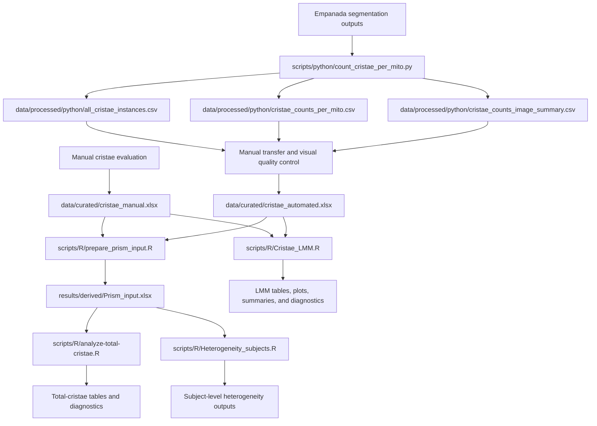

# Mitochondrial Ultrastructure Analysis

Pre-release repository for computational preprocessing, quality control, and
statistical analysis of mitochondrial ultrastructure and cristae morphology
data.

> **Project status:** The Python preprocessing workflow and all four R analysis
> workflows are implemented and have passed their GitHub Actions checks. The
> repository has not yet been formally released, archived in Zenodo, or assigned
> a DOI.

## Project scope

The repository supports two related analytical branches:

1. **Manual measurements** recorded directly in a curated Excel workbook.
2. **Automated measurements** derived from Empanada segmentation outputs using
   Python preprocessing and subsequently transferred into a curated Excel
   workbook with the same analytical structure as the manual workbook.

The Python preprocessing step applies only to the automated branch. Both
curated workbooks are then used by the downstream R workflows.

## Related image-analysis project

The automated segmentation outputs processed by the Python workflow originate
from the associated repository:

[Analysis of Mitochondrial Ultrastructure and Morphology](https://github.com/LMCF-IMG/Analysis_Mitochondrial_Ultrastructure_and_Morphology)

Raw microscopy images and upstream segmentation inputs are maintained outside
this repository and are not duplicated here.

## Authors and contributions

- **Nikol Volfová** — manual data evaluation, R-based statistical analyses,
  repository integration, documentation, testing, and maintenance.
- **Martin Čapek** ([LMCF-IMG](https://github.com/LMCF-IMG)) — original author
  of the Python preprocessing script and its core computational logic.

The repository version of the Python script was adapted for portable
command-line use, documented, and covered by synthetic tests with Martin
Čapek's knowledge and permission.

This software contribution statement does not determine authorship of the
associated research article.

## Analysis overview



## Data provenance and quality control

### Manual branch

Cristae were evaluated manually and recorded directly in:

```text
data/curated/cristae_manual.xlsx
```

This workbook is the curated tabular record used for the manual branch of the
downstream analyses.

### Automated branch

Empanada segmentation outputs were processed using:

```text
scripts/python/count_cristae_per_mito.py
```

The processed Python outputs included in this repository are:

```text
data/processed/python/all_cristae_instances.csv
data/processed/python/cristae_counts_per_mito.csv
data/processed/python/cristae_counts_image_summary.csv
```

Relevant values from the Python outputs were transferred into:

```text
data/curated/cristae_automated.xlsx
```

The automated workbook is not a direct Python output. It follows the analytical
structure of the manual workbook and is the curated input used by the
downstream R analyses.

### Quality control of mitochondrial segmentation objects

The automated workflow was designed to quantify cristae, not to independently
benchmark mitochondrial segmentation.

Mitochondrial labels were used to define compartments to which detected
cristae were assigned. Before statistical analysis, the labels were visually
reviewed to identify clear segmentation errors.

Labels that did not correspond to real mitochondrial profiles in the source
image were excluded because they did not represent valid compartments for
cristae quantification.

The exclusion criterion was not based on the number of detected cristae. Valid
mitochondrial profiles with zero detected cristae remained included.

The original Python CSV outputs were retained unchanged as the primary
computational outputs. The automated Excel workbook represents the curated
analytical dataset used for downstream cristae analyses.

A representative quality-control example is included in:

```text
docs/qc_examples/C2_002_30000x/
```

For this example, mitochondrial labels 1 and 4 were retained as valid
mitochondrial profiles. Labels 2 and 3 were excluded as mitochondrial
segmentation errors.

Detailed provenance and curation information is provided in:

```text
docs/DATA_PROVENANCE.md
```

## Repository structure

```text
.
├── .github/
│   └── workflows/
│       ├── python-tests.yml
│       ├── r-cristae-lmm.yml
│       ├── r-heterogeneity.yml
│       ├── r-prepare-prism.yml
│       └── r-total-cristae.yml
├── data/
│   ├── curated/
│   │   ├── cristae_automated.xlsx
│   │   └── cristae_manual.xlsx
│   └── processed/
│       └── python/
│           ├── all_cristae_instances.csv
│           ├── cristae_counts_image_summary.csv
│           ├── cristae_counts_per_mito.csv
│           └── README.md
├── docs/
│   ├── qc_examples/
│   │   └── C2_002_30000x/
│   │       ├── C2_002_30000x_mito__cristae_class_map.png
│   │       ├── C2_002_30000x_mito__cristae_ids.png
│   │       ├── C2_002_30000x_mito__cristae_overlay.png
│   │       ├── C2_002_30000x_mito__mitochondria_ids.png
│   │       ├── C2_002_30000x_mito__mitochondria_labels.tif
│   │       ├── README.md
│   │       └── qc_manifest.csv
│   ├── DATA_PROVENANCE.md
│   └── VALIDATION_PLAN.md
├── scripts/
│   ├── R/
│   │   ├── Cristae_LMM.R
│   │   ├── Heterogeneity_subjects.R
│   │   ├── analyze-total-cristae.R
│   │   └── prepare_prism_input.R
│   ├── python/
│   │   └── count_cristae_per_mito.py
│   └── README.md
├── tests/
│   └── python/
│       └── test_count_cristae_per_mito.py
├── .gitignore
├── CITATION.cff
├── CODE_OF_CONDUCT.md
├── CONTRIBUTING.md
├── LICENSE
├── README.md
├── SECURITY.md
└── requirements-python.txt
```

Generated analytical outputs are written under:

```text
results/derived/
```

They are generated during local or GitHub Actions runs, uploaded as workflow
artifacts, and not committed to the repository unless explicitly approved.

## Python environment

Python 3.12 is used for the documented preprocessing workflow.

### Linux and macOS

```bash
python3.12 -m venv .venv
source .venv/bin/activate
python -m pip install --upgrade pip
python -m pip install -r requirements-python.txt
```

### Windows PowerShell

```powershell
py -3.12 -m venv .venv
.venv\Scripts\Activate.ps1
python -m pip install --upgrade pip
python -m pip install -r requirements-python.txt
```

## Running the Python preprocessing workflow

Provide directories containing matching mitochondrial and cristae segmentation
masks and a protected output directory:

```bash
python scripts/python/count_cristae_per_mito.py \
  --mito-dir <PATH_TO_MITOCHONDRIAL_MASKS> \
  --cristae-dir <PATH_TO_CRISTAE_MASKS> \
  --output-dir <PROTECTED_OUTPUT_DIRECTORY> \
  --run-id <RUN_IDENTIFIER> \
  --fail-on-unpaired
```

On Windows PowerShell, the command can be written on one line:

```powershell
python scripts/python/count_cristae_per_mito.py --mito-dir <PATH_TO_MITOCHONDRIAL_MASKS> --cristae-dir <PATH_TO_CRISTAE_MASKS> --output-dir <PROTECTED_OUTPUT_DIRECTORY> --run-id <RUN_IDENTIFIER> --fail-on-unpaired
```

Display all supported options with:

```bash
python scripts/python/count_cristae_per_mito.py --help
```

Generated outputs should remain under a protected path until identifiers,
filenames, local paths, and embedded metadata have passed review.

## R analysis workflows

The R workflows should be run from the repository root.

### 1. Prepare the combined Prism input

```bash
Rscript scripts/R/prepare_prism_input.R
```

Inputs:

```text
data/curated/cristae_manual.xlsx
data/curated/cristae_automated.xlsx
```

Primary generated file:

```text
results/derived/Prism_input.xlsx
```

### 2. Analyse total cristae counts

```bash
Rscript scripts/R/analyze-total-cristae.R
```

This workflow reads the combined Prism input and generates the total-cristae
statistical analysis, model summaries, contrasts, diagnostics, and derived
result tables.

### 3. Analyse between-subject heterogeneity

```bash
Rscript scripts/R/Heterogeneity_subjects.R
```

This workflow reads the combined Prism input and generates subject-level
summaries used to evaluate heterogeneity across controls and patient groups for
both measurement methods.

### 4. Run the cristae linear mixed-model analysis

```bash
Rscript scripts/R/Cristae_LMM.R
```

This workflow reads the manual and automated workbooks directly and processes
them separately.

For each eligible metric, it fits:

```text
y ~ group + (1 | ID_cluster)
```

Planned contrasts compare Controls with patient groups P1-P10.

The workflow exports:

- structured Excel workbooks;
- quality-control and conversion audits;
- descriptive statistics;
- model-estimated means;
- planned contrasts and multiple-testing corrections;
- significant-result and review-required tables;
- individual publication-style plots;
- summary heatmaps and contrast overviews;
- residual-versus-fitted and Q-Q diagnostic plots.

Primary output root:

```text
results/derived/cristae_lmm_safe/
```

Additional script-level documentation is provided in:

```text
scripts/README.md
```

## GitHub Actions

The repository contains five automated workflows:

| Workflow file | Purpose |
| --- | --- |
| `.github/workflows/python-tests.yml` | Runs the synthetic Python test suite. |
| `.github/workflows/r-prepare-prism.yml` | Runs Prism input preparation and verifies the generated workbook. |
| `.github/workflows/r-total-cristae.yml` | Runs the total-cristae analysis and verifies its outputs. |
| `.github/workflows/r-heterogeneity.yml` | Runs the subject-heterogeneity analysis and verifies its outputs. |
| `.github/workflows/r-cristae-lmm.yml` | Runs the manual and automated LMM analyses and verifies their outputs. |

All five workflows passed during the current pre-release validation.

The R workflows are integration checks that execute the complete repository
analysis scripts against the curated repository inputs and verify that the
expected outputs are created.

## Local testing and validation

### Python synthetic tests

Run locally with:

```bash
python -m unittest discover -s tests/python -p "test_*.py" -v
```

### R workflow validation

Run the four R scripts from the repository root in this order:

```bash
Rscript scripts/R/prepare_prism_input.R
Rscript scripts/R/analyze-total-cristae.R
Rscript scripts/R/Heterogeneity_subjects.R
Rscript scripts/R/Cristae_LMM.R
```

The first script creates the shared Prism input required by the total-cristae
and heterogeneity workflows.

`Cristae_LMM.R` reads the two curated workbooks directly and does not depend on
`Prism_input.xlsx`.

The validation and future release-readiness work are documented in:

```text
docs/VALIDATION_PLAN.md
```

## Current status

| Component | Status |
| --- | --- |
| Python preprocessing script | Included |
| Python dependency record | Included |
| Python synthetic tests | Passed |
| Python GitHub Actions workflow | Passed |
| Processed Python CSV files | Included |
| Curated manual workbook | Included |
| Curated automated workbook | Included |
| Representative QC example | Included |
| Prism input preparation workflow | Implemented and passed |
| Total-cristae analysis workflow | Implemented and passed |
| Subject-heterogeneity workflow | Implemented and passed |
| Cristae LMM workflow | Implemented and passed |
| Verification of expected R output files | Passed |
| Root-level citation metadata | Included |
| Formal versioned release | Not yet created |
| Zenodo archive and DOI | Not yet created |

The analyses contained in this repository represent the current analytical
workflow. Their validated outputs will be used in the associated publication.

Full reproduction from raw microscopy images is outside the scope of this
repository because raw images and upstream segmentation inputs are maintained
separately.

## Data availability and confidentiality

The repository includes:

- the two curated analytical workbooks;
- the three processed Python CSV files;
- one representative QC example;
- the Python and R analysis scripts;
- automated validation workflows.

The repository does not include:

- raw microscopy images;
- the complete upstream segmentation dataset;
- complete patient-level QC material;
- confidential manuscript files;
- protected source metadata;
- generated results that have not been approved for public release.

Before additional research-derived files are released, they should be reviewed
for subject or sample identifiers, filenames, local paths, embedded metadata,
confidential information, and publication status.

## Citation

Software citation metadata are provided in the root-level
[`CITATION.cff`](CITATION.cff) file.

The associated research article is intended to be the preferred scientific
citation once its final bibliographic metadata are available.

The following information will be added after verification and formal release:

- software version;
- release date;
- verified author affiliations;
- article title, journal, publication year, and DOI;
- Zenodo version DOI and concept DOI.

Verified ORCID identifiers are included in `CITATION.cff`.

No article, software, or Zenodo DOI is currently claimed.

## Contributing

Contribution guidelines are provided in:

```text
CONTRIBUTING.md
```

All contributors are expected to follow:

```text
CODE_OF_CONDUCT.md
```

## License

The source code and original documentation in this repository are available
under the [MIT License](LICENSE).

Copyright (c) 2026 Nikol Volfová  
Copyright (c) 2026 Martin Čapek

Research data, generated research tables, figures, microscopy files,
segmentation outputs, and manuscript content are not automatically covered by
the MIT License unless a separate license or explicit statement says otherwise.

## Security and responsible disclosure

Please follow the instructions in [`SECURITY.md`](SECURITY.md) when reporting a
security issue or accidental exposure of confidential information.
