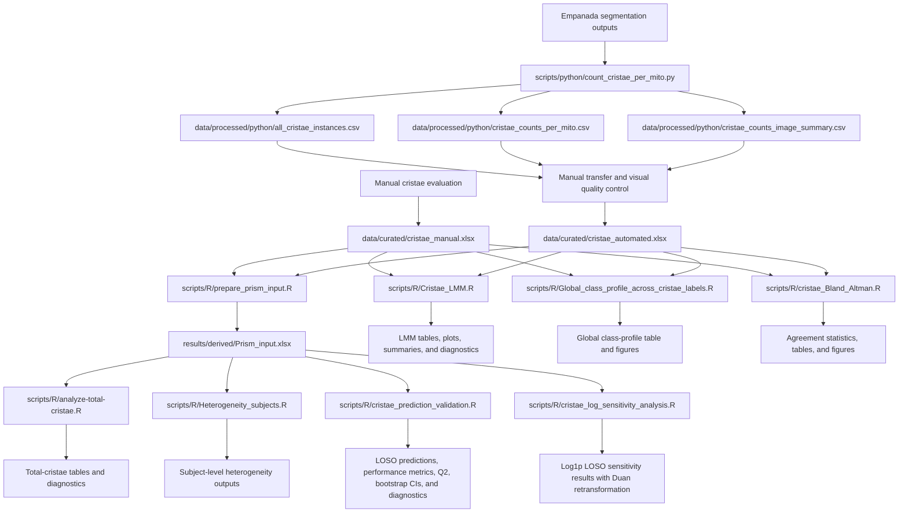

# Mitochondrial Ultrastructure Analysis

[](https://doi.org/10.5281/zenodo.21872763)

Publication companion repository for computational preprocessing, quality
control, validation, and statistical analysis of mitochondrial ultrastructure
and cristae morphology data.

> **Project status:** Version 1.1.0 is the current released version of the
> repository. It extends the validated v1.0.0 workflow with subject-level
> predictive validation of automated cristae quantification and a
> log-transformed predictive sensitivity analysis. The release is publicly
> available on GitHub and archived in Zenodo.
>
> **Version v1.1.0 DOI:** [10.5281/zenodo.21890084](https://doi.org/10.5281/zenodo.21890084)
> **Concept DOI:** [10.5281/zenodo.21872763](https://doi.org/10.5281/zenodo.21872763)

## Project scope

This repository contains the downstream analytical workflow used to process,
curate, validate, and statistically analyse mitochondrial ultrastructure and
cristae morphology data associated with the accompanying research publication.

The repository supports two related analytical branches:

1. **Manual measurements** recorded directly in a curated Excel workbook.
2. **Automated measurements** derived from Empanada segmentation outputs using
   Python preprocessing and subsequently transferred into a curated Excel
   workbook with the same analytical structure as the manual workbook.

The Python preprocessing step applies only to the automated branch. Both
curated workbooks are used by the downstream R workflows.

This repository is intended as a publication companion and does not duplicate
the complete upstream image-analysis project or the raw microscopy dataset.

## Related upstream image-analysis project

The automated segmentation outputs processed by the Python workflow originate
from the associated upstream project:

[Analysis of Mitochondrial Ultrastructure and Morphology](https://github.com/LMCF-IMG/Analysis_Mitochondrial_Ultrastructure_and_Morphology)

Raw microscopy images and the complete upstream segmentation dataset are
maintained outside this repository and are not duplicated here.

The relationship between the projects is therefore:

```text
raw microscopy images
        ↓
upstream image-analysis and segmentation project
        ↓
segmentation outputs
        ↓
this publication companion repository
        ↓
curation, statistical analysis, validation, and publication outputs
```

## Authors and contributions

* **Nikol Volfová** — manual data evaluation, R-based statistical analyses,
  repository integration, documentation, testing, and maintenance.
* **Martin Čapek** ([LMCF-IMG](https://github.com/LMCF-IMG)) — original author
  of the Python preprocessing script and its core computational logic.

The repository version of the Python script was adapted for portable
command-line use, documented, integrated into the project, and covered by
synthetic tests with Martin Čapek's knowledge and permission.

This software contribution statement does not determine authorship of the
associated research article.

## Analysis overview



## Data provenance and quality control

### Manual branch

Cristae were evaluated manually and recorded directly in:

```text
data/curated/cristae_manual.xlsx
```

This workbook is the curated tabular record used for the manual branch of the
downstream analyses.

### Automated branch

The processed Python outputs included in this repository are:

```text
data/processed/python/all_cristae_instances.csv
data/processed/python/cristae_counts_per_mito.csv
data/processed/python/cristae_counts_image_summary.csv
```

Relevant values from the Python outputs were transferred into:

```text
data/curated/cristae_automated.xlsx
```

The automated workbook is not a direct Python output. It follows the analytical
structure of the manual workbook and is the curated input used by the
downstream R analyses.

### Quality control of mitochondrial segmentation objects

The automated workflow was designed to quantify cristae within segmented
mitochondrial compartments. It was not intended as an independent assessment
of mitochondrial segmentation performance.

Mitochondrial labels were visually reviewed before statistical analysis.
Labels that did not correspond to real mitochondrial profiles in the source
image were excluded because they did not represent valid compartments for
cristae quantification.

The exclusion criterion was not based on the number of detected cristae. Valid
mitochondrial profiles with zero detected cristae remained included.

The original Python CSV outputs were retained unchanged as the primary
computational outputs. The automated Excel workbook represents the curated
analytical dataset used for the downstream cristae analyses.

A representative quality-control example is included in:

```text
docs/qc_examples/C2_002_30000x/
```

For this example, mitochondrial labels 1 and 4 were retained as valid
mitochondrial profiles. Labels 2 and 3 were excluded as mitochondrial
segmentation artefacts.

The example contains derived segmentation and QC outputs. The original source
image is not duplicated in this companion repository.

Detailed provenance and curation information is provided in
[`docs/DATA_PROVENANCE.md`](docs/DATA_PROVENANCE.md).

## Repository structure

```text
.
├── .github/
│   └── workflows/
│       ├── python-tests.yml
│       ├── r-cristae-bland-altman.yml
│       ├── r-cristae-lmm.yml
│       ├── r-cristae-log-sensitivity.yml
│       ├── r-cristae-prediction-validation.yml
│       ├── r-global-class-profile.yml
│       ├── r-heterogeneity.yml
│       ├── r-prepare-prism.yml
│       └── r-total-cristae.yml
├── data/
│   ├── curated/
│   │   ├── cristae_automated.xlsx
│   │   └── cristae_manual.xlsx
│   ├── processed/
│   │   └── python/
│   │       ├── all_cristae_instances.csv
│   │       ├── cristae_counts_image_summary.csv
│   │       ├── cristae_counts_per_mito.csv
│   │       └── README.md
│   └── README.md
├── docs/
│   ├── qc_examples/
│   │   └── C2_002_30000x/
│   │       ├── C2_002_30000x_mito__cristae_class_map.png
│   │       ├── C2_002_30000x_mito__cristae_ids.png
│   │       ├── C2_002_30000x_mito__cristae_overlay.png
│   │       ├── C2_002_30000x_mito__mitochondria_ids.png
│   │       ├── C2_002_30000x_mito__mitochondria_labels.tif
│   │       ├── README.md
│   │       └── qc_manifest.csv
│   ├── DATA_PROVENANCE.md
│   └── VALIDATION_PLAN.md
├── scripts/
│   ├── R/
│   │   ├── Cristae_LMM.R
│   │   ├── Global_class_profile_across_cristae_labels.R
│   │   ├── Heterogeneity_subjects.R
│   │   ├── analyze-total-cristae.R
│   │   ├── cristae_Bland_Altman.R
│   │   ├── cristae_log_sensitivity_analysis.R
│   │   ├── cristae_prediction_validation.R
│   │   └── prepare_prism_input.R
│   ├── python/
│   │   └── count_cristae_per_mito.py
│   └── README.md
├── tests/
│   └── python/
│       └── test_count_cristae_per_mito.py
├── .gitignore
├── CITATION.cff
├── CODE_OF_CONDUCT.md
├── CONTRIBUTING.md
├── LICENSE
├── LICENSE-DATA.md
├── README.md
├── SECURITY.md
└── requirements-python.txt
```

Generated analytical outputs are written under:

```text
results/derived/
```

They are generated during local or GitHub Actions runs, uploaded as workflow
artifacts, and not committed to the repository unless explicitly approved.

## Python environment

Python 3.12 is used for the documented preprocessing workflow.

### Linux and macOS

```bash
python3.12 -m venv .venv
source .venv/bin/activate
python -m pip install --upgrade pip
python -m pip install -r requirements-python.txt
```

### Windows PowerShell

```powershell
py -3.12 -m venv .venv
.venv\Scripts\Activate.ps1
python -m pip install --upgrade pip
python -m pip install -r requirements-python.txt
```

## Running the Python preprocessing workflow

Provide directories containing matching mitochondrial and cristae segmentation
masks and a protected output directory:

```bash
python scripts/python/count_cristae_per_mito.py \
  --mito-dir <PATH_TO_MITOCHONDRIAL_MASKS> \
  --cristae-dir <PATH_TO_CRISTAE_MASKS> \
  --output-dir <PROTECTED_OUTPUT_DIRECTORY> \
  --run-id <RUN_IDENTIFIER> \
  --fail-on-unpaired
```

On Windows PowerShell, the command can be written on one line:

```powershell
python scripts/python/count_cristae_per_mito.py --mito-dir <PATH_TO_MITOCHONDRIAL_MASKS> --cristae-dir <PATH_TO_CRISTAE_MASKS> --output-dir <PROTECTED_OUTPUT_DIRECTORY> --run-id <RUN_IDENTIFIER> --fail-on-unpaired
```

Display all supported options with:

```bash
python scripts/python/count_cristae_per_mito.py --help
```

Generated outputs should remain under a protected path until identifiers,
filenames, local paths, and embedded metadata have passed review.

## R analysis workflows

All R workflows should be run from the repository root.

### 1. Prepare the combined Prism input

```bash
Rscript scripts/R/prepare_prism_input.R
```

Inputs:

```text
data/curated/cristae_manual.xlsx
data/curated/cristae_automated.xlsx
```

Primary generated file:

```text
results/derived/Prism_input.xlsx
```

### 2. Analyse total cristae counts

```bash
Rscript scripts/R/analyze-total-cristae.R
```

This workflow reads the combined Prism input and generates the total-cristae
statistical analysis, model summaries, contrasts, diagnostics, tables, and
figures.

### 3. Analyse between-subject heterogeneity

```bash
Rscript scripts/R/Heterogeneity_subjects.R
```

This workflow reads the combined Prism input and generates subject-level
summaries used to evaluate heterogeneity across controls and patient groups for
both measurement methods.

### 4. Run the cristae linear mixed-model analysis

```bash
Rscript scripts/R/Cristae_LMM.R
```

This workflow reads the manual and automated workbooks directly and processes
them separately.

For each eligible metric, it fits:

```text
y ~ group + (1 | ID_cluster)
```

Planned contrasts compare Controls with patient groups P1-P10.

The workflow exports:

* structured Excel workbooks;
* quality-control and numeric-conversion audits;
* descriptive statistics;
* model-estimated means;
* planned contrasts;
* raw and Benjamini-Hochberg adjusted p-values;
* significant-result and review-required tables;
* individual plots;
* summary heatmaps and contrast overviews;
* residual-versus-fitted and Q-Q diagnostic plots.

Primary output root:

```text
results/derived/cristae_lmm_safe/
```

### 5. Generate the global cristae class profile

```bash
Rscript scripts/R/Global_class_profile_across_cristae_labels.R
```

Inputs:

```text
data/curated/cristae_manual.xlsx
data/curated/cristae_automated.xlsx
```

The workflow sums valid values for `Label 2` through `Label 12` separately for
the manual and automated workbooks, calculates the relative abundance of each
class within each method, and generates a dumbbell plot comparing both class
profiles.

Primary outputs:

```text
results/derived/global_class_profile/global_class_profile_data.xlsx
results/derived/global_class_profile/global_class_profile_dumbbell_colored.png
results/derived/global_class_profile/global_class_profile_dumbbell_colored.pdf
```

### 6. Analyse agreement between manual and automated cristae counts

```bash
Rscript scripts/R/cristae_Bland_Altman.R
```

Inputs:

```text
data/curated/cristae_manual.xlsx
data/curated/cristae_automated.xlsx
```

The workflow:

* aggregates `Label 2` through `Label 12` to one total cristae count per image;
* pairs manual and automated measurements by worksheet and image identifier;
* performs Bland-Altman agreement analysis;
* calculates Pearson correlation and ordinary least-squares regression;
* evaluates proportional bias and the distribution of paired differences;
* exports processed data, statistics, diagnostics, summaries, and
  publication-quality figures.

Primary output root:

```text
results/derived/cristae_bland_altman/
```

The generated files include:

```text
cristae_manual_vs_automated_results.xlsx
analysis_summary.txt
R_session_info.txt
Bland_Altman_agreement_plot.pdf
Bland_Altman_agreement_plot.png
Bland_Altman_agreement_plot.tiff
Manual_vs_automated_scatter_plot.pdf
Manual_vs_automated_scatter_plot.png
Manual_vs_automated_scatter_plot.tiff
Bland_Altman_and_scatter_panel.pdf
Bland_Altman_and_scatter_panel.png
Bland_Altman_and_scatter_panel.tiff
```

### 7. Validate predictive calibration in unseen biological subjects

```bash
Rscript scripts/R/cristae_prediction_validation.R
```

Input:

```text
results/derived/Prism_input.xlsx
worksheet: compare_images
```

This workflow asks whether automated cristae quantification can predict the
corresponding manual reference measurement in a previously unseen biological
subject. It uses leave-one-subject-out cross-validation (LOSO-CV), holding out
all images from one biological subject at a time and predicting that subject
with fixed effects only.

The primary endpoint is:

```text
manual_mean_per_mito ~ auto_mean_per_mito
```

The secondary endpoint is:

```text
manual_total ~ auto_total
```

The calibrated mixed-effects model is compared with two explicit out-of-sample
benchmarks:

* `automated_identity`: predicted Manual = observed Automated;
* `training_subject_mean`: equal-weight mean of the subject-specific Manual
  means in the training set.

The workflow reports image-weighted and subject-balanced prediction errors,
pooled cross-validated R2, calibration intercept and slope, predictive Q2
against both benchmarks, subject-cluster bootstrap 95% confidence intervals,
LOSO fold diagnostics, and a descriptive full-data calibration model.

Primary output root:

```text
results/derived/cristae_prediction_validation/
```

### 8. Run the log-transformed predictive sensitivity analysis

```bash
Rscript scripts/R/cristae_log_sensitivity_analysis.R
```

Input:

```text
results/derived/Prism_input.xlsx
worksheet: compare_images
```

This workflow is a sensitivity analysis for the primary predictive validation.
It retains the same subject-level LOSO design but fits the calibration
relationship on the `log1p` scale:

```text
log1p(Manual) ~ log1p(Automated) + (1 | subject_id)
```

Held-out subjects are predicted with fixed effects only. Predictions are
returned to the original measurement scale with a fold-specific Duan smearing
correction estimated exclusively from the training data.

The sensitivity workflow uses the same primary and secondary endpoints,
prediction benchmarks, predictive Q2 comparisons, subject-balanced metrics,
cluster-bootstrap uncertainty analysis, and convergence/singularity checks as
the primary predictive workflow. It is intended to assess robustness of the
primary predictive conclusion and does not replace the original-scale model.

Primary output root:

```text
results/derived/log_sensitivity_prediction/
```

Additional script-level documentation is provided in
[`scripts/README.md`](scripts/README.md).

## GitHub Actions

The repository contains nine automated workflows:

| Workflow file                                           | Purpose                                                                                                                                                 |
| ------------------------------------------------------- | ------------------------------------------------------------------------------------------------------------------------------------------------------- |
| `.github/workflows/python-tests.yml`                    | Runs the synthetic Python test suite.                                                                                                                   |
| `.github/workflows/r-prepare-prism.yml`                 | Runs Prism input preparation and verifies the generated workbook.                                                                                       |
| `.github/workflows/r-total-cristae.yml`                 | Runs the total-cristae analysis and verifies its outputs.                                                                                               |
| `.github/workflows/r-heterogeneity.yml`                 | Runs the subject-heterogeneity analysis and verifies its outputs.                                                                                       |
| `.github/workflows/r-cristae-lmm.yml`                   | Runs the manual and automated LMM analyses and verifies their outputs.                                                                                  |
| `.github/workflows/r-global-class-profile.yml`          | Runs the global cristae class-profile analysis and verifies its table and figures.                                                                      |
| `.github/workflows/r-cristae-bland-altman.yml`          | Runs the manual-versus-automated agreement analysis and verifies its statistical and figure outputs.                                                    |
| `.github/workflows/r-cristae-prediction-validation.yml` | Regenerates the Prism input, runs subject-level LOSO predictive validation, verifies the expected outputs, and uploads the results as an artifact.      |
| `.github/workflows/r-cristae-log-sensitivity.yml`       | Regenerates the Prism input, runs the log-transformed LOSO sensitivity analysis, verifies the expected outputs, and uploads the results as an artifact. |

The original seven workflows were already included in the v1.0.0 release.
Version v1.1.0 adds the predictive-validation and log-transformed sensitivity
workflows to the released analytical workflow.

The Python workflow is covered by synthetic tests. The R workflows are covered
by integration checks that execute the complete analysis scripts against the
included curated workbooks and verify the expected generated outputs.

## Local testing and validation

### Python synthetic tests

Run locally with:

```bash
python -m unittest discover -s tests/python -p "test_*.py" -v
```

### R workflow validation

Run the eight R scripts from the repository root:

```bash
Rscript scripts/R/prepare_prism_input.R
Rscript scripts/R/analyze-total-cristae.R
Rscript scripts/R/Heterogeneity_subjects.R
Rscript scripts/R/Cristae_LMM.R
Rscript scripts/R/Global_class_profile_across_cristae_labels.R
Rscript scripts/R/cristae_Bland_Altman.R
Rscript scripts/R/cristae_prediction_validation.R
Rscript scripts/R/cristae_log_sensitivity_analysis.R
```

`prepare_prism_input.R` creates the shared Prism input required by the
total-cristae, heterogeneity, predictive-validation, and log-sensitivity
workflows.

`Cristae_LMM.R`, `Global_class_profile_across_cristae_labels.R`, and
`cristae_Bland_Altman.R` read the two curated workbooks directly and do not
depend on `Prism_input.xlsx`.

The validation and release-readiness procedures are documented in
[`docs/VALIDATION_PLAN.md`](docs/VALIDATION_PLAN.md).

## Current status

| Component                                       | Status                                |
| ----------------------------------------------- | ------------------------------------- |
| Python preprocessing script                     | Included                              |
| Python dependency record                        | Included                              |
| Python synthetic tests                          | Passed                                |
| Python GitHub Actions workflow                  | Passed                                |
| Processed Python CSV files                      | Included; approved for public release |
| Curated manual workbook                         | Included; approved for public release |
| Curated automated workbook                      | Included; approved for public release |
| Representative QC example                       | Included; approved for public release |
| Prism input preparation workflow                | Implemented and passed                |
| Total-cristae analysis workflow                 | Implemented and passed                |
| Subject-heterogeneity workflow                  | Implemented and passed                |
| Cristae LMM workflow                            | Implemented and passed                |
| Global cristae class-profile workflow           | Implemented and passed                |
| Manual-versus-automated agreement workflow      | Implemented and passed                |
| Predictive validation workflow                  | Implemented and passed                |
| Log-transformed predictive sensitivity workflow | Implemented and passed                |
| Verification of expected R output files         | Passed                                |
| Root-level citation metadata                    | Included                              |
| Software license                                | MIT                                   |
| Data and QC license                             | CC BY 4.0                             |
| Formal versioned release                        | v1.1.0                                |
| Zenodo archive                                  | Published                             |
| Zenodo version DOI                              | 10.5281/zenodo.21890084               |
| Zenodo concept DOI                              | 10.5281/zenodo.21872763               |

Version `v1.1.0` extends the original `v1.0.0` release with subject-level
predictive validation and a log-transformed predictive sensitivity analysis.
The previous release remains an immutable historical Zenodo record.

The curated data and analytical outputs are associated with the accompanying
research publication.

Full reproduction from raw microscopy images is outside the scope of this
repository because raw images and upstream segmentation inputs are maintained
separately.

## Data availability and confidentiality

The repository includes:

* the two curated analytical workbooks;
* the three processed Python CSV files;
* one representative QC example;
* the Python and R analysis scripts;
* automated validation workflows.

The research-derived materials currently included in the repository have been
reviewed and approved for public release.

The repository does not include:

* raw microscopy images;
* the complete upstream segmentation dataset;
* complete patient-level QC material;
* confidential manuscript files;
* protected source metadata;
* research materials that have not been approved for public release.

Before additional research-derived files are released, they should be reviewed
for subject or sample identifiers, filenames, local paths, embedded metadata,
confidential information, licensing, consent restrictions, and publication
status.

## Citation

Citation metadata are provided in the root-level
[`CITATION.cff`](CITATION.cff) file.

### Repository citation

The current archived release `v1.1.0` is available from Zenodo:

**Version DOI:**
[10.5281/zenodo.21890084](https://doi.org/10.5281/zenodo.21890084)

**Concept DOI:**
[10.5281/zenodo.21872763](https://doi.org/10.5281/zenodo.21872763)

The version DOI identifies the archived `v1.1.0` release. The concept DOI
identifies the project as a whole across versions and should be used when
referring generally to the evolving software repository.

The associated research article is intended to be the preferred scientific
citation once its final bibliographic metadata are available.

Verified author ORCID identifiers are included in `CITATION.cff`.

The article DOI and final publication metadata will be added only after they
are formally available and verified.

## Contributing

Contribution guidelines are provided in
[`CONTRIBUTING.md`](CONTRIBUTING.md).

All contributors are expected to follow the project
[`CODE_OF_CONDUCT.md`](CODE_OF_CONDUCT.md).

## License

Source code and original project documentation are licensed under the
[MIT License](LICENSE).

Research-derived data and quality-control materials distributed under
`data/curated/`, `data/processed/python/`, and `docs/qc_examples/` are licensed
under the Creative Commons Attribution 4.0 International License (CC BY 4.0),
as described in [`LICENSE-DATA.md`](LICENSE-DATA.md).

The data license applies only to eligible materials actually distributed in
this repository and does not grant rights to protected or external research
materials.

## Security and responsible disclosure

Please follow the instructions in [`SECURITY.md`](SECURITY.md) when reporting a
security issue or accidental exposure of confidential information.
