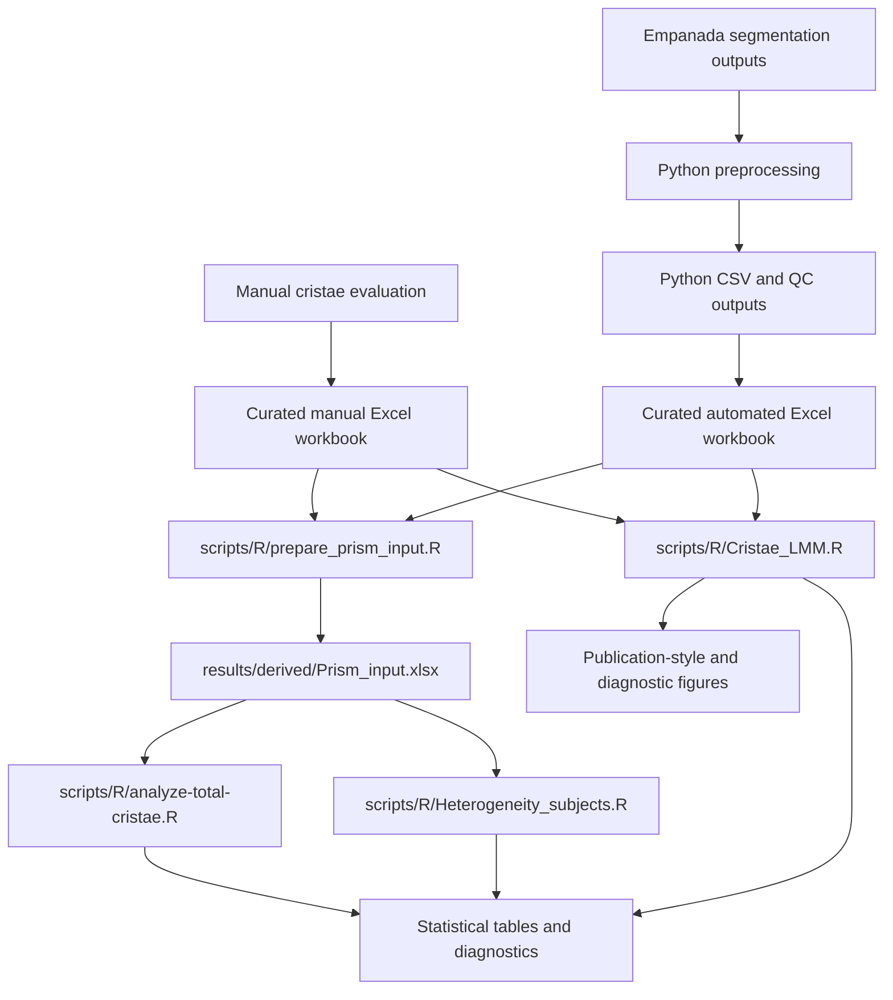

# Mitochondrial Ultrastructure Analysis

Pre-release companion repository for Python preprocessing and R-based statistical analysis of mitochondrial ultrastructure and cristae morphology data.

> **Development status:** The Python preprocessing workflow and four R analysis workflows are implemented and exercised through GitHub Actions. The repository has not yet been formally released, archived in Zenodo, or assigned a DOI. Final public-release checks for data, metadata, citation, and reproducibility are still in progress.

## Project scope

The project contains two related measurement branches:

1. **Manual measurements**, recorded directly in a curated Excel workbook.
2. **Automated measurements**, derived from Empanada segmentation outputs using Python preprocessing and transferred into a curated Excel workbook with a schema matching the manual workbook.

The Python workflow applies only to the automated branch. Manual measurements do not pass through the Python preprocessing script.

The curated manual and automated workbooks are then used by the R workflows for paired total-cristae analyses, subject-level heterogeneity summaries, and method-specific cristae morphometry analyses.

## Related image-analysis project

The automated segmentation outputs processed by the Python workflow originate from the associated project:

[Analysis of Mitochondrial Ultrastructure and Morphology](https://github.com/LMCF-IMG/Analysis_Mitochondrial_Ultrastructure_and_Morphology)

The segmented image inputs are maintained in that upstream project and are not duplicated here.

## Authors and contributions

- **Nikol Volfová** — manual data evaluation; author of the R analysis scripts and downstream statistical analyses; repository integration, documentation, and maintenance.
- **Martin Čapek** ([LMCF-IMG](https://github.com/LMCF-IMG)) — original author of the Python preprocessing script and its core computational logic.

The repository version of the Python script was adapted for portable command-line use, documented, and covered by synthetic tests with Martin Čapek's knowledge and permission.

This software contribution statement does not determine authorship of the associated research article.

## Analysis workflow



## Data provenance and curation

### Manual branch

Cristae were evaluated manually and the measurements were entered directly into the curated manual workbook:

```text
data/curated/cristae_manual.xlsx
```

This workbook is the tabular analytical input for the manual branch.

### Automated branch

Empanada segmentation outputs are processed using:

```text
scripts/python/count_cristae_per_mito.py
```

The Python script generates per-image and summary CSV outputs together with quality-control artefacts. Relevant values are transferred into the curated automated workbook:

```text
data/curated/cristae_automated.xlsx
```

The automated workbook follows the schema required by the downstream R analyses.

### Quality control of mitochondrial segmentation objects

The automated workflow is designed to quantify cristae, not to perform an independent biological evaluation of mitochondrial segmentation quality.

Mitochondrial labels define the compartments to which detected cristae are assigned. Before statistical analysis, these labels are visually reviewed to identify clear segmentation errors. Labels that do not correspond to real mitochondrial profiles are excluded from the curated analytical dataset.

The exclusion criterion is not based on the number of detected cristae. Valid mitochondrial profiles with zero detected cristae remain included. The original Python outputs are retained as the primary computational output, while the curated automated workbook records the analytical dataset used downstream.

## Repository structure

```text
.
├── .github/
│   ├── ISSUE_TEMPLATE/
│   └── workflows/
│       ├── python-tests.yml
│       ├── r-prepare-prism.yml
│       ├── r-total-cristae.yml
│       ├── r-heterogeneity.yml
│       └── r-cristae-lmm.yml
├── data/
│   └── curated/
│       ├── cristae_manual.xlsx
│       └── cristae_automated.xlsx
├── docs/
├── metadata/
│   └── CITATION.cff.template
├── scripts/
│   ├── README.md
│   ├── R/
│   │   ├── prepare_prism_input.R
│   │   ├── analyze-total-cristae.R
│   │   ├── Heterogeneity_subjects.R
│   │   └── Cristae_LMM.R
│   └── python/
│       └── count_cristae_per_mito.py
├── tests/
│   └── python/
│       └── test_count_cristae_per_mito.py
├── .gitignore
├── CODE_OF_CONDUCT.md
├── LICENSE
├── README.md
├── SECURITY.md
└── requirements-python.txt
```

Generated tables, logs, diagnostics, and figures are written under `results/derived/` or uploaded as GitHub Actions artifacts. They are analytical outputs rather than source files.

See [`scripts/README.md`](scripts/README.md) for the script-level workflow and input/output contracts.

## Python environment

Python 3.12 is used for the tested command-line workflow.

### Linux or macOS

```bash
python3.12 -m venv .venv
source .venv/bin/activate
python -m pip install --upgrade pip
python -m pip install -r requirements-python.txt
```

### Windows PowerShell

```powershell
py -3.12 -m venv .venv
.venv\Scripts\Activate.ps1
python -m pip install --upgrade pip
python -m pip install -r requirements-python.txt
```

## Running Python preprocessing

Provide directories containing matching mitochondrial and cristae segmentation masks and a protected output directory:

```bash
python scripts/python/count_cristae_per_mito.py \
  --mito-dir <PATH_TO_MITOCHONDRIAL_MASKS> \
  --cristae-dir <PATH_TO_CRISTAE_MASKS> \
  --output-dir <PROTECTED_OUTPUT_DIRECTORY> \
  --run-id <RUN_IDENTIFIER> \
  --fail-on-unpaired
```

Display all supported options with:

```bash
python scripts/python/count_cristae_per_mito.py --help
```

Generated outputs should remain under a protected path until identifiers, filenames, paths, and embedded metadata have passed the release audit.

## Running the R analyses

Run the R scripts from the repository root in the following order.

### 1. Prepare the combined Prism input

```bash
Rscript scripts/R/prepare_prism_input.R
```

This step reads the curated manual and automated workbooks and creates:

```text
results/derived/Prism_input.xlsx
```

### 2. Analyse total cristae counts

```bash
Rscript scripts/R/analyze-total-cristae.R
```

This workflow reads the combined Prism input and produces documented statistical tables and model outputs for the total-cristae-count analysis.

### 3. Summarize between-subject heterogeneity

```bash
Rscript scripts/R/Heterogeneity_subjects.R
```

This workflow reads the combined Prism input and produces subject-level summaries for manual and automated measurements.

### 4. Analyse cristae morphometry

```bash
Rscript scripts/R/Cristae_LMM.R
```

This workflow reads the curated manual and automated workbooks separately. For each eligible metric, it fits a linear mixed-effects model:

```text
y ~ group + (1 | ID_cluster)
```

The workflow performs planned Controls-versus-patient contrasts, reports Benjamini-Hochberg-adjusted values, exports quality-control and model-diagnostic tables, and creates individual and summary figures. Its output root is:

```text
results/derived/cristae_lmm_safe/
```

The exact statistical definitions, eligibility criteria, safeguards, and output sheets are documented directly in the script.

## R dependencies

The GitHub Actions workflows install the packages required by each analysis on a clean runner. For local execution, install the packages referenced by the relevant script or workflow.

The cristae LMM workflow requires at least:

```r
install.packages(c(
  "openxlsx",
  "lme4",
  "lmerTest",
  "emmeans",
  "ggplot2",
  "dplyr",
  "tibble",
  "stringr",
  "tidyr"
))
```

A repository-wide `renv` lockfile has not yet been created.

## Testing and continuous integration

Run the synthetic Python test suite locally with:

```bash
python -m unittest discover -s tests/python -p "test_*.py" -v
```

GitHub Actions provides separate workflows for:

- Python synthetic tests;
- Prism input preparation;
- total cristae-count analysis;
- subject-level heterogeneity analysis; and
- cristae LMM analysis.

The workflows execute the scripts from a clean checkout, verify expected outputs, and upload generated results as temporary artifacts. All five workflows were successfully executed during the current pre-release validation.

The synthetic Python test demonstrates that the documented Python code executes on controlled fixtures and satisfies the tested invariants. It is not, by itself, an independent reproduction of the full research workflow or the associated publication.

## Reproducibility status

| Component | Status |
|---|---|
| Python command-line adaptation | Complete |
| Python dependency record | Complete |
| Python synthetic tests | Passed |
| Python GitHub Actions workflow | Passed |
| Prism input preparation script | Implemented and CI-validated |
| Total cristae-count analysis script | Implemented and CI-validated |
| Subject-heterogeneity analysis script | Implemented and CI-validated |
| Cristae LMM analysis script | Implemented and CI-validated |
| Curated workbook schema and QC documentation | Implemented in scripts and output workbooks |
| Independent comparison with all manuscript tables and figures | Pending |
| Public-release data and metadata audit | Pending |
| Repository-wide R package lock with `renv` | Pending |
| GitHub Release and Zenodo archive | Pending |

No claim of complete public reproducibility is made until the release data, metadata, environment, and publication-level comparisons have been finalized.

## Data availability and confidentiality

The current pre-release repository contains curated Excel inputs required by the R workflows. Their inclusion in a future public release remains subject to a final review for confidentiality, pseudonymization, authorship, permissions, and consistency with the associated article.

The segmented image inputs remain in the upstream image-analysis project and are not duplicated here. Raw microscopy data and confidential unpublished figures are not intended to be committed to this repository.

Before any additional research-derived files are released, they must be reviewed for:

- subject and sample identifiers;
- filenames and local paths;
- embedded metadata;
- unpublished results;
- confidential or personal information; and
- consistency with the associated research article.

Do not place research data, credentials, private paths, or confidential incident details in public GitHub issues.

## Citation

The associated research article is intended to be the preferred scientific citation. Its final bibliographic metadata and DOI are not yet available and are therefore not invented here.

`metadata/CITATION.cff.template` will be completed and renamed to `CITATION.cff` after the author order, software version, release date, article citation, repository metadata, and DOI information have been verified.

After a GitHub Release is archived by Zenodo, the verified DOI should be added consistently to:

- this README;
- `CITATION.cff`;
- the GitHub Release description; and
- the Zenodo record.

## Security and responsible reporting

For security-sensitive matters, follow [`SECURITY.md`](SECURITY.md). Community behaviour is governed by [`CODE_OF_CONDUCT.md`](CODE_OF_CONDUCT.md).

Do not disclose credentials, access tokens, private SSH keys, confidential data, unpublished microscopy files, or personal information in an issue.

## License

The source code and original documentation in this repository are available under the [MIT License](LICENSE).

Copyright (c) 2026 Nikol Volfová  
Copyright (c) 2026 Martin Čapek

Research data, generated research tables, figures, and manuscript content are not covered by the MIT License unless a separate license explicitly states otherwise.
