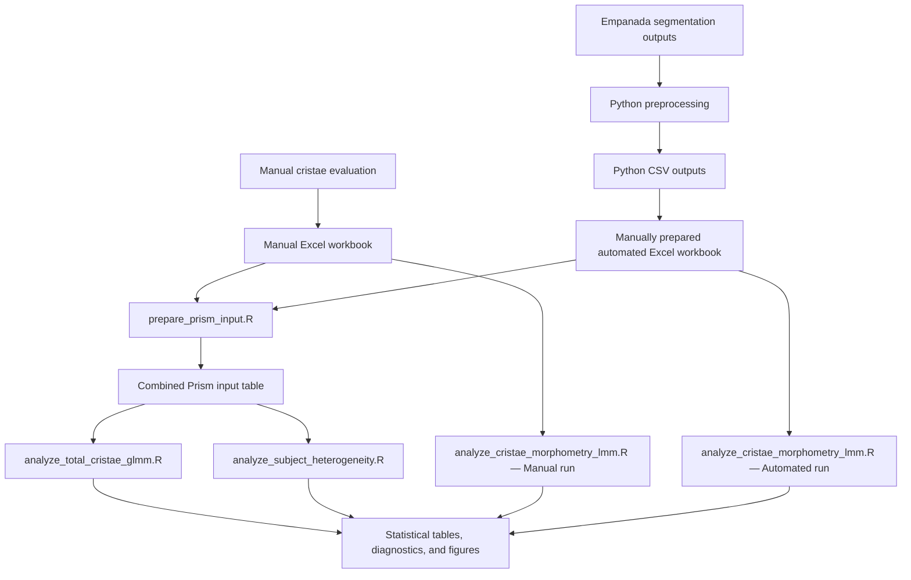

# Mitochondrial Ultrastructure Analysis

Pre-release repository for computational processing and statistical analysis of mitochondrial ultrastructure and cristae morphology data.

> **Development status:** The Python preprocessing workflow is included and covered by synthetic tests. The R analysis workflows are currently being reconstructed and validated against the original analysis files. The repository has not been formally released, archived, or assigned a DOI.

## Project scope

The project contains two distinct data-generation branches:

1. **Manual measurements**, recorded directly in a manually prepared Excel workbook.
2. **Automated measurements**, derived from Empanada segmentation outputs using Python preprocessing.

The Python workflow applies only to the automated branch. Manual measurements did not pass through the Python preprocessing script.

Relevant values from the Python-generated CSV outputs were transferred into an automated Excel workbook structured to match the manual workbook. These two workbooks were subsequently used in the R analysis workflows.

## Related image-analysis project

The automated segmentation outputs processed by the Python workflow originate from the associated project:

[Analysis of Mitochondrial Ultrastructure and Morphology](https://github.com/LMCF-IMG/Analysis_Mitochondrial_Ultrastructure_and_Morphology)

The segmented image inputs are maintained in that upstream project and are not duplicated here.

## Authors and contributions

* **Nikol Volfová** — manual data evaluation, R-based statistical analyses, repository integration, documentation, and maintenance.
* **Martin Čapek** ([LMCF-IMG](https://github.com/LMCF-IMG)) — original author of the Python preprocessing script and its core computational logic.

The repository version of the Python script was adapted for portable command-line use, documented, and covered by synthetic tests with Martin Čapek's knowledge and permission.

This software contribution statement does not determine authorship of the associated research article.

## Data provenance and analysis workflow



### Manual branch

Cristae were evaluated manually and the measurements were entered directly into a manual Excel workbook.

This workbook represents the primary tabular record of the manual measurements.

### Automated branch

Empanada segmentation outputs were processed using:

```text
scripts/python/count_cristae_per_mito.py
```

The Python script generates per-image and summary CSV outputs together with quality-control artefacts.

Relevant values from the Python CSV outputs were manually transferred into an automated Excel workbook with a schema matching the manual workbook.

The transfer from Python CSV outputs to the automated workbook is an original manual preparation step and will be independently validated before release.

### Quality control of mitochondrial segmentation objects

The purpose of the automated workflow was the quantification of cristae, not
the independent quantification or evaluation of mitochondrial segmentation.

Mitochondrial segmentation was used to define valid mitochondrial compartments
to which detected cristae were assigned. Before statistical analysis, the
mitochondrial labels were therefore visually reviewed to identify clear
segmentation errors.

Labels that did not correspond to real mitochondrial profiles in the source
image were excluded because they did not represent valid compartments for
cristae quantification. This curation did not involve modifying the original
Python outputs or mechanically correcting the segmentation masks.

The exclusion criterion was not based on the number of detected cristae.
Valid mitochondrial profiles with zero detected cristae remained included.
Only labels representing confirmed mitochondrial-segmentation errors were
excluded from the curated analytical dataset.

The original Python CSV files were retained unchanged as the primary
computational output. The automated Excel workbook represents the curated
analytical dataset used for downstream cristae analyses.

## Planned R analysis workflows

The new R scripts will reproduce the original analytical logic using documented inputs and explicit validation checks.

### Prism input preparation

```text
scripts/prepare_prism_input.R
```

Planned function:

* read the manual and automated Excel workbooks;
* standardize and validate their schemas;
* combine the two measurement methods;
* create the common Prism input table;
* record exclusions, missing values, duplicates, and row counts.

The generated Prism input table will be used by the total-cristae-count and between-subject heterogeneity analyses.

### Total cristae-count analysis

```text
scripts/analyze_total_cristae_glmm.R
```

Planned function:

* read the combined Prism input;
* validate the expected experimental structure;
* fit the count-data model;
* generate model diagnostics, contrasts, statistical tables, and figures.

The exact model specification will be documented after validation against the original analysis and manuscript results.

### Between-subject heterogeneity

```text
scripts/analyze_subject_heterogeneity.R
```

Planned function:

* read the combined Prism input;
* create subject-level summaries;
* compare manual and automated measurements;
* generate heterogeneity plots and heatmaps.

### Cristae morphometry analysis

```text
scripts/analyze_cristae_morphometry_lmm.R
```

The morphometry analysis does not use the combined Prism input.

The script will process the original workbooks separately:

```text
Manual Excel workbook
    → Manual LMM analysis

Automated Excel workbook
    → Automated LMM analysis
```

The script will apply a linear mixed-effects model and generate method-specific diagnostics, tables, and figures.

## Current repository structure

```text
.
├── .github/
│   ├── ISSUE_TEMPLATE/
│   └── workflows/
│       └── python-tests.yml
├── metadata/
│   └── CITATION.cff.template
├── scripts/
│   └── python/
│       └── count_cristae_per_mito.py
├── tests/
│   └── python/
│       └── test_count_cristae_per_mito.py
├── .gitignore
├── CODE_OF_CONDUCT.md
├── LICENSE
├── README.md
├── SECURITY.md
└── requirements-python.txt
```

The R scripts and their supporting documentation will be added only after their input contracts and outputs have been validated.

## Python requirements

Use Python 3.12 in an isolated environment:

```bash
python3.12 -m venv .venv
source .venv/bin/activate
python -m pip install --upgrade pip
python -m pip install -r requirements-python.txt
```

On Windows PowerShell, activate the environment using:

```powershell
.venv\Scripts\Activate.ps1
```

## Running Python preprocessing

Provide directories containing the matching automated segmentation masks and a protected output directory:

```bash
python scripts/python/count_cristae_per_mito.py \
  --mito-dir <PATH_TO_MITOCHONDRIAL_MASKS> \
  --cristae-dir <PATH_TO_CRISTAE_MASKS> \
  --output-dir <PROTECTED_OUTPUT_DIRECTORY> \
  --run-id <RUN_IDENTIFIER> \
  --fail-on-unpaired
```

Use:

```bash
python scripts/python/count_cristae_per_mito.py --help
```

to display all supported options.

Generated outputs should remain under a protected path until identifiers, filenames, paths, and embedded metadata have passed the release audit.

## Testing

Run the synthetic Python test suite locally with:

```bash
python -m unittest discover -s tests/python -p "test_*.py" -v
```

The same test suite runs automatically through GitHub Actions.

The synthetic test demonstrates that the documented Python code executes on a controlled fixture and satisfies the tested invariants. It does not yet constitute independent reproduction of the complete research workflow or manuscript results.

## Reproducibility status

| Component                                                             | Status   |
| --------------------------------------------------------------------- | -------- |
| Python command-line adaptation                                        | Complete |
| Python dependency record                                              | Complete |
| Python synthetic tests                                                | Passed   |
| Automated Python GitHub Actions workflow                              | Passed   |
| Validation of Python CSV outputs against the automated Excel workbook | Pending  |
| Manual workbook schema documentation                                  | Pending  |
| Automated workbook schema documentation                               | Pending  |
| New Prism input preparation script                                    | Planned  |
| New total-cristae-count analysis script                               | Planned  |
| New subject-heterogeneity analysis script                             | Planned  |
| New morphometry LMM script                                            | Planned  |
| Comparison with original analytical outputs                           | Pending  |
| Comparison with manuscript tables and figures                         | Pending  |
| R package-version lock with `renv`                                    | Pending  |

No claim of complete workflow reproducibility is made at the current pre-release stage.

## Data availability and confidentiality

The original manual and automated workbooks, the combined Prism input, microscopy files, and unpublished analytical outputs are not currently included in the repository.

Before any research-derived tables are released, they will be reviewed for:

* subject and sample identifiers;
* filenames and local paths;
* embedded metadata;
* unpublished results;
* confidential or personal information;
* consistency with the associated research article.

## Citation

The associated research article is intended to be the preferred citation.

Its final bibliographic metadata and DOI are not yet available and are therefore not included here.

`metadata/CITATION.cff.template` will be completed and renamed to `CITATION.cff` only after the author list, software version, release date, article citation, and DOI metadata have been verified.

## License

The source code and original documentation in this repository are available under the [MIT License](LICENSE).

Copyright (c) 2026 Nikol Volfová.

Research data, generated research tables, figures, and manuscript content are not covered by the MIT License unless a separate license explicitly states otherwise.
