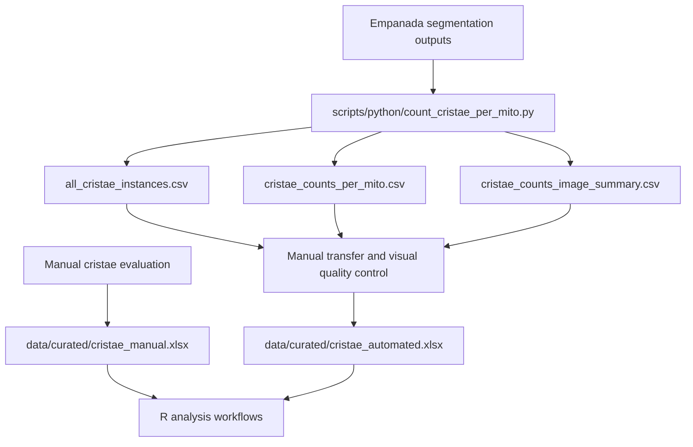

# Data Directory

This directory contains the reviewed analytical inputs and processed tabular
outputs used by the mitochondrial ultrastructure analysis workflows.

The repository is currently maintained as a private pre-release repository.
Inclusion of a file here does not by itself mean that the file has been
approved for unrestricted public redistribution.

## Directory structure

```text
data/
├── curated/
│   ├── cristae_automated.xlsx
│   └── cristae_manual.xlsx
├── processed/
│   └── python/
│       ├── all_cristae_instances.csv
│       ├── cristae_counts_image_summary.csv
│       └── cristae_counts_per_mito.csv
└── README.md
```

## Curated analytical workbooks

### Manual workbook

```text
data/curated/cristae_manual.xlsx
```

This workbook contains the curated measurements from the manual evaluation
branch.

The manual measurements were recorded directly in the workbook and did not
pass through the Python preprocessing workflow.

### Automated workbook

```text
data/curated/cristae_automated.xlsx
```

This workbook contains the curated analytical data used for the automated
measurement branch.

It is not a direct output of the Python script. Relevant values from the
processed Python CSV files were transferred into the workbook, and
mitochondrial segmentation objects were visually reviewed before downstream
analysis.

Confirmed mitochondrial segmentation errors were excluded during curation.
Valid mitochondrial profiles with zero detected cristae remained included.

Both curated workbooks are used by the R analysis workflows.

## Processed Python outputs

The following Python-generated tabular outputs are included unchanged:

```text
data/processed/python/all_cristae_instances.csv
data/processed/python/cristae_counts_per_mito.csv
data/processed/python/cristae_counts_image_summary.csv
```

These files were generated from upstream mitochondrial and cristae segmentation
outputs using:

```text
scripts/python/count_cristae_per_mito.py
```

They are retained as the primary computational outputs of the Python
preprocessing step.

The complete Python output directories, upstream segmentation inputs, and raw
microscopy images are maintained outside this repository.

## Data flow



## Files not included

The repository does not contain:

- raw microscopy images;
- the complete upstream segmentation dataset;
- complete patient-level quality-control material;
- lookup tables connecting pseudonymous identifiers to real persons;
- confidential manuscript files;
- protected source metadata;
- generated analytical results that have not been approved for inclusion.

Generated R outputs belong under:

```text
results/derived/
```

They are created during local or GitHub Actions runs and are normally uploaded
as workflow artifacts rather than committed to the repository.

## Data review requirements

Before any additional research-derived file is committed or publicly released,
review it for:

- subject or sample identifiers;
- image and acquisition filenames;
- local filesystem paths;
- hidden worksheets, rows, or columns;
- formulas, comments, named ranges, and external links;
- workbook and document metadata;
- personal or confidential information;
- unpublished results;
- licensing and consent restrictions;
- consistency with the associated publication.

## Identifiers

The analytical files use pseudonymous identifiers such as control and patient
group codes.

The repository must not contain a lookup table connecting these identifiers to
real persons or confidential clinical records.

Identifier conventions must be verified again before formal public release.

## Licensing

The repository MIT License applies to source code and original documentation.

It does not automatically grant redistribution rights for:

- research measurements;
- microscopy images;
- segmentation masks;
- processed research tables;
- quality-control images;
- publication figures;
- manuscript content.

Licensing and permitted reuse of research-derived data and QC material must be
reviewed separately before formal public release.

## Current status

| Data component | Repository status |
| --- | --- |
| Curated manual workbook | Included |
| Curated automated workbook | Included |
| Processed Python CSV files | Included |
| Representative QC example | Included under `docs/qc_examples/` |
| Raw microscopy images | Maintained outside the repository |
| Complete segmentation dataset | Maintained outside the repository |
| Generated R results | Created as workflow outputs; not committed by default |
| Formal public data-release approval | Pending |
| Data and QC licensing decision | Pending |

For detailed provenance and curation information, see:

```text
docs/DATA_PROVENANCE.md
```
