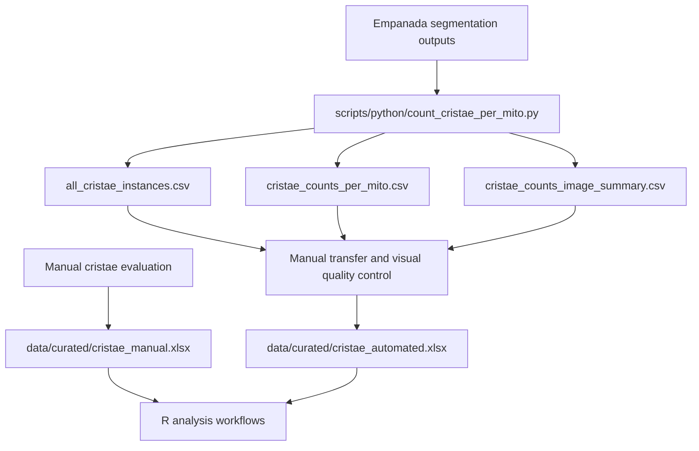

# Data Directory

This directory contains the reviewed analytical inputs and processed tabular
outputs used by the mitochondrial ultrastructure analysis workflows.

The research-derived files distributed in this repository have been reviewed
and approved for public release. This approval applies only to the materials
actually included in this repository and does not extend to raw microscopy
images, protected source data, complete patient-level QC materials, or other
research materials maintained outside the repository.

## Directory structure

```text
data/
├── curated/
│   ├── cristae_automated.xlsx
│   └── cristae_manual.xlsx
├── processed/
│   └── python/
│       ├── all_cristae_instances.csv
│       ├── cristae_counts_image_summary.csv
│       └── cristae_counts_per_mito.csv
└── README.md
```

## Curated analytical workbooks

### Manual workbook

```text
data/curated/cristae_manual.xlsx
```

This workbook contains the curated measurements from the manual evaluation
branch.

The manual measurements were recorded directly in the workbook and did not
pass through the Python preprocessing workflow.

### Automated workbook

```text
data/curated/cristae_automated.xlsx
```

This workbook contains the curated analytical data used for the automated
measurement branch.

It is not a direct output of the Python script. Relevant values from the
processed Python CSV files were transferred into the workbook, and
mitochondrial segmentation objects were visually reviewed before downstream
analysis.

Confirmed mitochondrial segmentation errors were excluded during curation.
Valid mitochondrial profiles with zero detected cristae remained included.

Both curated workbooks are used by the R analysis workflows.

## Processed Python outputs

The following Python-generated tabular outputs are included unchanged:

```text
data/processed/python/all_cristae_instances.csv
data/processed/python/cristae_counts_per_mito.csv
data/processed/python/cristae_counts_image_summary.csv
```

These files were generated from upstream mitochondrial and cristae segmentation
outputs using:

```text
scripts/python/count_cristae_per_mito.py
```

They are retained as the primary computational outputs of the Python
preprocessing step.

The complete Python output directories, upstream segmentation inputs, and raw
microscopy images are maintained outside this repository.

## Relationship to the upstream project

This repository is a downstream analysis and publication companion repository.

The source-image provenance and upstream image-analysis workflow are associated
with:

[Analysis_Mitochondrial_Ultrastructure_and_Morphology](https://github.com/LMCF-IMG/Analysis_Mitochondrial_Ultrastructure_and_Morphology)

Raw microscopy images and the complete upstream segmentation dataset are not
duplicated here.

## Data flow



## Representative quality-control material

A representative QC example is provided under:

```text
docs/qc_examples/C2_002_30000x/
```

This example documents the visual review of mitochondrial segmentation objects
before preparation of the curated automated analytical dataset.

It illustrates the type of segmentation artefact that was excluded during
curation while preserving the original computational outputs unchanged.

The original source image is not duplicated in this companion repository.

For detailed provenance and curation information, see:

```text
docs/DATA_PROVENANCE.md
```

## Files not included

The repository does not contain:

- raw microscopy images;
- the complete upstream segmentation dataset;
- complete patient-level quality-control material;
- lookup tables connecting pseudonymous identifiers to real persons;
- confidential manuscript files;
- protected source metadata;
- research materials that have not been approved for public release.

Generated R outputs belong under:

```text
results/derived/
```

They are created during local or GitHub Actions runs and are normally uploaded
as workflow artifacts rather than committed to the repository.

## Data review requirements

Before any additional research-derived file is committed or publicly released,
review it for:

- subject or sample identifiers;
- image and acquisition filenames;
- local filesystem paths;
- hidden worksheets, rows, or columns;
- formulas, comments, named ranges, and external links;
- workbook and document metadata;
- personal or confidential information;
- unpublished results;
- licensing and consent restrictions;
- consistency with the associated publication.

Approval of the currently distributed files does not automatically approve
additional research-derived files for future public release.

## Identifiers

The analytical files use pseudonymous identifiers such as control and patient
group codes.

The repository does not contain a lookup table connecting these identifiers to
real persons or confidential clinical records.

## Licensing

Source code and original project documentation are licensed under the MIT
License provided in:

```text
LICENSE
```

The research-derived data and quality-control materials distributed in:

```text
data/curated/
data/processed/python/
docs/qc_examples/
```

are licensed under the Creative Commons Attribution 4.0 International License
(CC BY 4.0), as specified in:

```text
LICENSE-DATA.md
```

The CC BY 4.0 license applies only to eligible materials actually distributed
in this repository. It does not grant access to or redistribution rights for
raw microscopy images, protected research datasets, complete patient-level QC
materials, confidential metadata, or other materials maintained outside this
repository.

Third-party materials, if any, remain subject to their own applicable licenses
and terms.

## Current status

| Data component | Repository status |
| --- | --- |
| Curated manual workbook | Included; approved for public release |
| Curated automated workbook | Included; approved for public release |
| Processed Python CSV files | Included; approved for public release |
| Representative QC example | Included; approved for public release |
| Raw microscopy images | Maintained outside the repository |
| Complete segmentation dataset | Maintained outside the repository |
| Generated R results | Created as workflow outputs; not committed by default |
| Formal public data-release approval | Approved for included materials |
| Data and QC license | CC BY 4.0 |

For detailed provenance and curation information, see:

```text
docs/DATA_PROVENANCE.md
```
