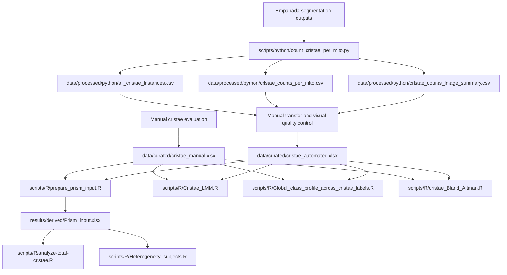

# Data Provenance

This document records the origin, transformation, curation, and downstream use
of the manual and automated mitochondrial ultrastructure measurements included
in this repository.

Its purpose is to distinguish clearly between:

- primary manual measurements;
- automated measurements derived from image segmentation;
- unchanged Python-generated outputs;
- curated analytical Excel workbooks;
- documented visual quality control;
- R-derived intermediate tables;
- generated statistical and graphical outputs; and
- the inputs used by each analytical workflow.

## Provenance overview

The study contains two measurement branches with different initial
data-generation procedures.



The Python workflow applies only to the automated branch. Manual measurements
do not pass through Python preprocessing.

## Manual measurement branch

Cristae were evaluated manually and the measurements were recorded directly in:

```text
data/curated/cristae_manual.xlsx
```

This workbook is the curated tabular analytical input for the manual branch.

The manual measurements:

- were not generated by Empanada;
- were not processed by the Python preprocessing script;
- were recorded independently of the automated segmentation workflow; and
- are used directly or through a generated intermediate by the R workflows.

The workbook contains separate worksheets for the control and patient groups
used by the downstream analyses.

## Automated measurement branch

### Upstream segmentation source

Automated segmentation outputs originate from the associated Empanada-based
image-analysis project:

[Analysis of Mitochondrial Ultrastructure and Morphology](https://github.com/LMCF-IMG/Analysis_Mitochondrial_Ultrastructure_and_Morphology)

The upstream segmentation masks are not duplicated in this repository.

### Python preprocessing

The segmentation outputs were processed using:

```text
scripts/python/count_cristae_per_mito.py
```

The original Python preprocessing logic was written by Martin Čapek. The
repository version was adapted for portable command-line execution, documented,
and covered by synthetic tests with his knowledge and permission.

The Python workflow assigns detected cristae to segmented mitochondrial objects
and generates outputs at several levels of aggregation.

The processed CSV files included in this repository are:

```text
data/processed/python/all_cristae_instances.csv
data/processed/python/cristae_counts_per_mito.csv
data/processed/python/cristae_counts_image_summary.csv
```

The files represent:

- `all_cristae_instances.csv` — individual detected crista instances and their
  mitochondrial-object assignments;
- `cristae_counts_per_mito.csv` — crista counts summarized by mitochondrial
  object;
- `cristae_counts_image_summary.csv` — image-level summary counts.

Additional documentation for these files is provided in:

```text
data/processed/python/README.md
```

These CSV files are preserved as the primary computational reference outputs of
the Python workflow.

## Preparation of the curated automated workbook

The curated automated analytical workbook is:

```text
data/curated/cristae_automated.xlsx
```

It is not a direct file produced by the Python script.

Relevant values from the Python-generated outputs were transferred into an
Excel workbook whose worksheet structure matches the manual workbook. The
automated workbook was then used as the curated analytical input for the R
workflows.

The transition is therefore:

```text
Python-generated CSV and QC outputs
    → manual transfer of relevant values
    → visual review of mitochondrial labels
    → exclusion of confirmed segmentation errors
    → curated automated analytical workbook
```

The unchanged Python CSV files and the curated automated workbook serve
different purposes:

- the Python CSV files preserve the computational output;
- the automated workbook records the curated dataset used for downstream
  statistical analysis.

The automated workbook should not be described as a mechanically regenerated
copy of the Python image-summary CSV.

## Curation of mitochondrial segmentation errors

The automated workflow was designed to quantify cristae within segmented
mitochondrial compartments. It was not intended as an independent biological
assessment of mitochondrial number or segmentation performance.

Mitochondrial labels were used to define the compartments to which detected
cristae were assigned. Before downstream analysis, these labels were visually
reviewed for clear segmentation errors.

A mitochondrial label was excluded when it did not correspond to a real
mitochondrial profile in the source image and therefore did not represent a
valid compartment for crista quantification.

The exclusion decision was not based on the number of detected cristae.

Valid mitochondrial profiles with zero detected cristae remained included.
Only labels confirmed as mitochondrial-segmentation errors were removed from
the curated analytical dataset.

The original Python CSV outputs and segmentation-derived QC files were not
rewritten to conceal these exclusions. The curation is represented in the
curated automated workbook used by the R analyses.

## Representative QC example

A representative control example is included at:

```text
docs/qc_examples/C2_002_30000x/
```

The directory contains:

```text
C2_002_30000x_mito__cristae_class_map.png
C2_002_30000x_mito__cristae_ids.png
C2_002_30000x_mito__cristae_overlay.png
C2_002_30000x_mito__mitochondria_ids.png
C2_002_30000x_mito__mitochondria_labels.tif
README.md
qc_manifest.csv
```

For image `C2_002_30000x`, the Python output contained mitochondrial labels
1, 2, 3, and 4.

Visual inspection showed that:

- labels 1 and 4 corresponded to real mitochondrial profiles;
- labels 2 and 3 did not correspond to visible mitochondrial objects and were
  classified as mitochondrial-segmentation errors.

Labels 2 and 3 were therefore excluded from the curated analytical dataset.

Their exclusion was not caused by a zero crista count. The rule remained that
valid mitochondrial profiles with zero detected cristae were retained.

The example documents the curation principle without distributing the complete
protected image-level QC dataset.

See:

```text
docs/qc_examples/C2_002_30000x/README.md
docs/qc_examples/C2_002_30000x/qc_manifest.csv
```

for the example-specific documentation and file inventory.

## R-derived intermediate data

### Combined Prism input

The script:

```text
scripts/R/prepare_prism_input.R
```

reads:

```text
data/curated/cristae_manual.xlsx
data/curated/cristae_automated.xlsx
```

and generates:

```text
results/derived/Prism_input.xlsx
```

The generated workbook contains paired image-level manual and automated
measurements and supporting tables for downstream analysis.

The primary paired worksheet is:

```text
compare_images
```

`Prism_input.xlsx` is a derived analytical intermediate. It is generated during
local runs or GitHub Actions and is not a primary measurement source.

It is used by:

```text
scripts/R/analyze-total-cristae.R
scripts/R/Heterogeneity_subjects.R
```

The other four R workflows read the curated workbooks directly.

## Downstream analyses

### Total cristae-count analysis

Script:

```text
scripts/R/analyze-total-cristae.R
```

Input:

```text
results/derived/Prism_input.xlsx
```

Primary worksheet:

```text
compare_images
```

This workflow uses paired manual and automated image-level count data and
generates model results, diagnostics, contrasts, tables, and figures under
`results/derived/`.

### Between-subject heterogeneity analysis

Script:

```text
scripts/R/Heterogeneity_subjects.R
```

Input:

```text
results/derived/Prism_input.xlsx
```

Primary worksheet:

```text
compare_images
```

This workflow creates subject-level summaries, control reference ranges,
image-level variability summaries, and crista-class profiles for the manual and
automated methods.

### Cristae linear mixed-model analysis

Script:

```text
scripts/R/Cristae_LMM.R
```

Inputs:

```text
data/curated/cristae_manual.xlsx
data/curated/cristae_automated.xlsx
```

This workflow does not use `Prism_input.xlsx`.

The manual and automated workbooks are processed separately within the same
script. For each eligible retained metric, the workflow fits:

```text
y ~ group + (1 | ID_cluster)
```

and generates method-specific Excel workbooks, plots, summary visualizations,
and model diagnostics under:

```text
results/derived/cristae_lmm_safe/
```

### Global cristae class-profile analysis

Script:

```text
scripts/R/Global_class_profile_across_cristae_labels.R
```

Inputs:

```text
data/curated/cristae_manual.xlsx
data/curated/cristae_automated.xlsx
```

This workflow does not use `Prism_input.xlsx`.

It:

- identifies `Label 2` through `Label 12` in both workbooks;
- sums valid values separately for the manual and automated methods;
- calculates the relative abundance of each class within each method;
- exports the summarized values; and
- generates the global dumbbell profile plot.

Outputs are written under:

```text
results/derived/global_class_profile/
```

Primary files:

```text
global_class_profile_data.xlsx
global_class_profile_dumbbell_colored.png
global_class_profile_dumbbell_colored.pdf
```

### Manual-versus-automated agreement analysis

Script:

```text
scripts/R/cristae_Bland_Altman.R
```

Inputs:

```text
data/curated/cristae_manual.xlsx
data/curated/cristae_automated.xlsx
```

This workflow does not use `Prism_input.xlsx`.

It:

- aggregates `Label 2` through `Label 12` to one total crista count per image;
- pairs manual and automated observations using worksheet name and image
  identifier;
- performs Bland-Altman agreement analysis;
- calculates Pearson correlation;
- fits an ordinary least-squares linear regression;
- evaluates proportional bias and the distribution of paired differences; and
- exports paired data, statistics, diagnostic results, summaries, and figures.

The Bland-Altman difference is defined as:

```text
automated - manual
```

Outputs are written under:

```text
results/derived/cristae_bland_altman/
```

The workflow exports:

- an Excel workbook containing processed data and statistical results;
- a human-readable text summary;
- R session information;
- Bland-Altman figures;
- manual-versus-automated scatter figures; and
- a combined two-panel figure.

Figures are exported as PDF, PNG, and TIFF.

## Source, curated, derived, and generated file classes

| File class | Repository location | Meaning |
| --- | --- | --- |
| Curated manual analytical input | `data/curated/cristae_manual.xlsx` | Primary tabular input for the manual measurement branch |
| Python computational outputs | `data/processed/python/` | Unchanged processed outputs from automated segmentation |
| Curated automated analytical input | `data/curated/cristae_automated.xlsx` | Manually transferred and visually curated downstream input |
| Representative QC material | `docs/qc_examples/C2_002_30000x/` | Example documenting the segmentation-error exclusion rule |
| Derived paired R input | `results/derived/Prism_input.xlsx` | Generated intermediate for total-cristae and heterogeneity analyses |
| Generated statistical outputs | `results/derived/` | Tables, summaries, logs, plots, and diagnostics generated by R workflows |
| Workflow artifacts | GitHub Actions artifacts | Temporary downloadable outputs from automated validation runs |

## Automated validation status

| Component | Status |
| --- | --- |
| Python preprocessing script | Included |
| Python dependency record | Included |
| Synthetic Python tests | Passed |
| Python GitHub Actions workflow | Passed |
| Processed Python CSV files | Included |
| Curated manual workbook | Included |
| Curated automated workbook | Included |
| Representative visual QC example | Included |
| Prism input preparation workflow | Implemented and passed |
| Total cristae-count workflow | Implemented and passed |
| Between-subject heterogeneity workflow | Implemented and passed |
| Manual and automated LMM workflow | Implemented and passed |
| Global cristae class-profile workflow | Implemented and passed |
| Manual-versus-automated agreement workflow | Implemented and passed |
| Verification of expected R output files | Passed in GitHub Actions |
| Publication consistency with repository data and analyses | Confirmed |
| Complete release of all image-level QC material | Not included; protected research material |
| Formal versioned release and Zenodo DOI | Pending |

The automated checks establish that the repository scripts execute against the
included curated inputs and generate the expected output files.

They do not constitute full reproduction from raw microscopy images because the
raw images and upstream segmentation inputs are maintained outside this
repository.

## Data-release boundaries

The repository includes:

- the curated manual workbook;
- the curated automated workbook;
- the three processed Python CSV files;
- one representative QC example;
- the Python and R analysis scripts;
- automated validation workflows.

The repository does not include:

- raw microscopy images;
- the complete upstream segmentation dataset;
- complete patient-level QC image material;
- protected source metadata;
- confidential manuscript files;
- unpublished figures not approved for release;
- workflow artifacts that have not passed a release review.

Before any additional research-derived file is published, it should be reviewed
for:

- subject and sample identifiers;
- filenames and local filesystem paths;
- embedded metadata;
- confidential or personal information;
- unpublished results;
- licensing and consent restrictions; and
- consistency with the associated research article.

## Related documentation

- [`../README.md`](../README.md) — repository overview and execution guide
- [`../scripts/README.md`](../scripts/README.md) — script-level inputs, outputs,
  and workflow order
- [`../data/README.md`](../data/README.md) — data-directory overview
- [`VALIDATION_PLAN.md`](VALIDATION_PLAN.md) — validation and release checks
- [`../data/processed/python/README.md`](../data/processed/python/README.md) —
  processed Python output documentation
- [`qc_examples/C2_002_30000x/README.md`](qc_examples/C2_002_30000x/README.md) —
  representative QC example
