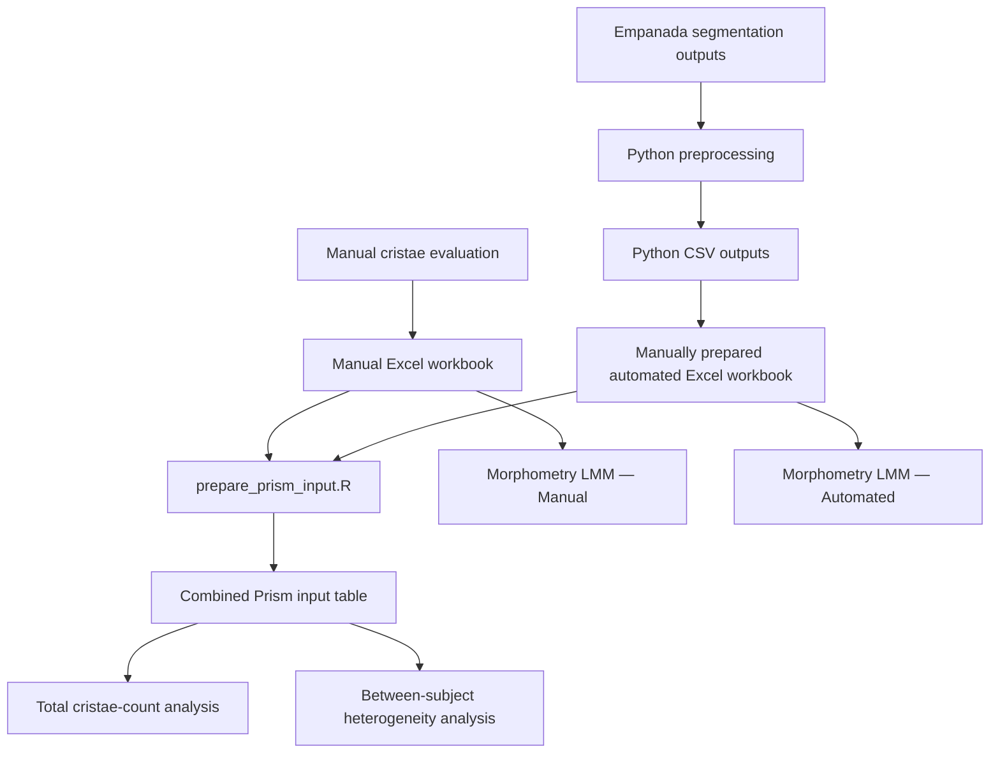

# Data Provenance

This document records the provenance of the manual and automated mitochondrial ultrastructure measurements used in the downstream statistical analyses.

The purpose of this document is to distinguish:

* primary manual measurements;
* automated measurements derived from image segmentation;
* manually prepared analytical workbooks;
* derived R input tables; and
* the inputs used by each statistical analysis.

## Overview

The study used two independent measurement branches:

1. manual cristae evaluation;
2. automated segmentation and Python-based preprocessing.

The two branches did not share the same initial data-processing workflow.



## Manual measurement branch

Cristae were evaluated manually and the resulting measurements were entered directly into an Excel workbook.

The manual workbook is the primary tabular record of the manual measurements.

The manual measurements:

* were not generated by Empanada;
* were not processed by the Python preprocessing script;
* were recorded independently of the automated segmentation workflow; and
* were subsequently used as an input to the R analyses.

The exact workbook filename, worksheet names, column schema, and validation rules will be documented after the original analysis workbook has been reviewed.

## Automated measurement branch

Automated segmentation outputs were generated using the associated Empanada-based image-analysis workflow.

The segmentation outputs were processed using:

```text
scripts/python/count_cristae_per_mito.py
```

The Python script generated CSV outputs containing measurements derived from the automated segmentation results.

The Python preprocessing workflow applies only to the automated branch.

## Preparation of the automated workbook

Relevant values from the Python-generated CSV outputs were manually copied into an Excel workbook.

The automated workbook was prepared to match the structure of the manual workbook so that the two datasets could be processed using a common downstream R workflow.

Therefore, the automated Excel workbook is not a direct Python output. It is a manually prepared analytical workbook derived from the Python CSV outputs.

The transition:

```text
Python CSV outputs
    → manual transfer of selected values
    → automated Excel workbook
```

is an original manual data-preparation step.

Before release, the automated workbook will be validated against the corresponding Python CSV outputs to verify:

* sample and image identifiers;
* transferred columns;
* row counts;
* missing and duplicated records;
* numerical values;
* excluded records; and
* consistency of the workbook with the original Python outputs.

### Curation of mitochondrial segmentation errors

The automated workflow was designed to quantify cristae within segmented
mitochondrial compartments. It was not intended as an independent assessment
of mitochondrial number or mitochondrial segmentation performance.

The mitochondrial segmentation labels were used to assign cristae to valid
mitochondrial profiles. Before the downstream analysis, these labels were
visually reviewed for clear segmentation errors.

A label was excluded when it did not correspond to a real mitochondrial
profile in the source image and therefore did not represent a valid
compartment for cristae quantification.

The decision was not based on whether cristae were detected. Valid
mitochondrial profiles with zero detected cristae remained included, whereas
confirmed mitochondrial-segmentation artefacts were excluded.

The data relationship was therefore:

```text
unchanged Python outputs
    → review of mitochondrial labels used as cristae compartments
    → exclusion of confirmed mitochondrial-segmentation errors
    → curated automated analytical workbook

### Representative control example

For control image `C2_002_30000x`, the Python output contained mitochondrial
labels 1, 2, 3, and 4.

Visual inspection showed that labels 1 and 4 corresponded to real
mitochondrial profiles. Labels 2 and 3 did not correspond to visible
mitochondrial objects and were confirmed as mitochondrial-segmentation errors.

Because the purpose of the workflow was cristae quantification within valid
mitochondrial compartments, labels 2 and 3 were excluded from the curated
analytical dataset.

Their exclusion was not caused by a zero cristae count. Valid mitochondrial
profiles with zero detected cristae remained included.

This representative control example illustrates the quality-control principle.
Complete patient-level QC material is not publicly distributed because it
belongs to a protected research dataset.

## Analyses using the combined Prism input

The combined Prism input table was used for two downstream analytical branches.

### Total cristae-count analysis

Planned repository script:

```text
scripts/analyze_total_cristae_glmm.R
```

This analysis uses the combined manual and automated count data.

The final model specification, exclusions, contrasts, and outputs will be documented after comparison with the original analysis and manuscript results.

### Between-subject heterogeneity analysis

Planned repository script:

```text
scripts/analyze_subject_heterogeneity.R
```

This analysis uses the combined Prism input to generate subject-level summaries and comparisons between manual and automated measurements.

## Morphometry analysis

The morphometry analysis did not use the combined Prism input.

Instead, the manual and automated Excel workbooks were processed separately using the same analytical workflow.

Planned repository script:

```text
scripts/analyze_cristae_morphometry_lmm.R
```

The intended execution pattern is:

```text
Manual Excel workbook
    → Manual morphometry LMM analysis

Automated Excel workbook
    → Automated morphometry LMM analysis
```

The two method-specific runs will produce separate diagnostics, tables, and figures.

## Original versus reconstructed workflow

The repository distinguishes between:

### Original analysis workflow

The procedures and files that were actually used to generate the results reported in the manuscript.

### Reconstructed reproducible workflow

New scripts and documentation created to reproduce, validate, and clearly document the original analytical logic.

The reconstructed workflow may automate previously manual steps, but such automation will not be presented as part of the original analysis.

Any difference between the original and reconstructed workflows will be documented explicitly.

## Validation status

| Component                                     | Status             |
| --------------------------------------------- | ------------------ |
| Python preprocessing script                   | Included           |
| Synthetic Python tests                        | Passed             |
| Automated GitHub Actions test                 | Passed             |
| Manual workbook schema                        | Pending validation |
| Automated workbook schema                     | Pending validation |
| Python CSV to automated workbook comparison   | Pending            |
| Combined Prism input reconstruction           | Planned            |
| Total cristae-count analysis reconstruction   | Planned            |
| Subject-heterogeneity analysis reconstruction | Planned            |
| Manual morphometry LMM reconstruction         | Planned            |
| Automated morphometry LMM reconstruction      | Planned            |
| Comparison with original outputs              | Pending            |
| Comparison with manuscript results            | Pending            |

## Data release boundaries

The following files are not currently included in the public repository:

* original manual workbook;
* original automated workbook;
* original combined Prism input;
* microscopy image files;
* unpublished analytical outputs;
* manuscript tables and figures; and
* files containing identifiers, internal paths, or confidential metadata.

Research-derived files will be considered for release only after review of:

* pseudonymization;
* subject and sample identifiers;
* filenames;
* local filesystem paths;
* embedded metadata;
* unpublished results;
* licensing and consent restrictions; and
* consistency with the associated research article.

## Known information still requiring documentation

The following details remain to be verified from the original files:

* exact workbook filenames;
* worksheet names;
* input and output column schemas;
* units of measurement;
* row-level observational units;
* exclusion rules;
* missing-value handling;
* exact Python CSV files used for the automated workbook;
* transformations performed during Prism input preparation;
* R and package versions; and
* correspondence between analytical outputs and manuscript figures or tables.
