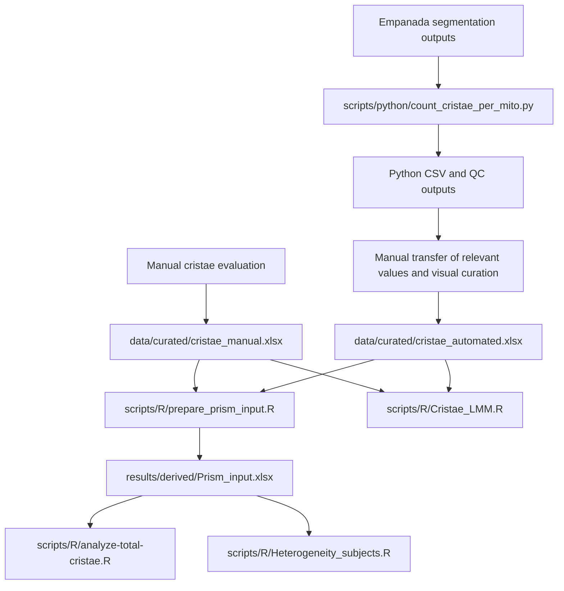

# Analysis Scripts

This directory contains the Python preprocessing workflow and the four R
analysis workflows used in the mitochondrial ultrastructure and cristae
analysis.

All commands below are intended to be run from the repository root.

## Directory structure

```text
scripts/
├── R/
│   ├── prepare_prism_input.R
│   ├── analyze-total-cristae.R
│   ├── Heterogeneity_subjects.R
│   └── Cristae_LMM.R
├── python/
│   └── count_cristae_per_mito.py
└── README.md
```

## Data-flow overview

The repository contains two measurement branches.

1. **Manual branch**  
   Manual measurements were entered directly into the curated manual workbook:

   ```text
   data/curated/cristae_manual.xlsx
   ```

2. **Automated branch**  
   Empanada segmentation outputs were processed by the Python script. The
   Python workflow generated CSV and quality-control outputs. Relevant values
   were then transferred manually into the curated automated workbook and the
   mitochondrial labels were visually reviewed before downstream analysis:

   ```text
   data/curated/cristae_automated.xlsx
   ```

The Python script does **not** create the curated automated Excel workbook
directly. The workbook is a separate curated analytical input. The original
Python outputs remain unchanged as the primary computational outputs.



## Python preprocessing

### Script

```text
scripts/python/count_cristae_per_mito.py
```

### Scope

The Python script applies only to the automated branch. Manual measurements do
not pass through it.

The script processes matching mitochondrial and cristae segmentation masks and
generates computational outputs including per-mitochondrion and image-level
CSV tables, quality-control information, and run-specific output files.

### Authorship

The original Python preprocessing script and its core computational logic were
written by **Martin Čapek**. The repository version was adapted for portable
command-line execution, documented, integrated into the repository, and
covered by synthetic tests with his knowledge and permission.

### Run

```bash
python scripts/python/count_cristae_per_mito.py \
  --mito-dir <PATH_TO_MITOCHONDRIAL_MASKS> \
  --cristae-dir <PATH_TO_CRISTAE_MASKS> \
  --output-dir <PROTECTED_OUTPUT_DIRECTORY> \
  --run-id <RUN_IDENTIFIER> \
  --fail-on-unpaired
```

Display all supported options with:

```bash
python scripts/python/count_cristae_per_mito.py --help
```

### Test

The synthetic test suite is located at:

```text
tests/python/test_count_cristae_per_mito.py
```

Run it with:

```bash
python -m unittest discover -s tests/python -p "test_*.py" -v
```

The same test suite is executed by:

```text
.github/workflows/python-tests.yml
```

## R workflow order

Run the R workflows from the repository root in this order:

```bash
Rscript scripts/R/prepare_prism_input.R
Rscript scripts/R/analyze-total-cristae.R
Rscript scripts/R/Heterogeneity_subjects.R
Rscript scripts/R/Cristae_LMM.R
```

The first workflow creates the combined Prism input required by the
total-cristae and heterogeneity analyses.

`Cristae_LMM.R` does not use `Prism_input.xlsx`. It reads the manual and
automated curated workbooks directly.

## 1. Prism input preparation

### Script

```text
scripts/R/prepare_prism_input.R
```

### Inputs

```text
data/curated/cristae_manual.xlsx
data/curated/cristae_automated.xlsx
```

### Processing

The script:

- reads both curated workbooks;
- converts the workbook structure to per-mitochondrion records;
- aggregates measurements to one row per image;
- calculates total cristae counts, numbers of mitochondria, cristae per
  mitochondrion, and Label 2-Label 12 totals;
- joins manual and automated image-level records by group and image identifier;
- records images missing from either method;
- prepares paired tables for downstream analyses and Prism.

### Output

```text
results/derived/Prism_input.xlsx
```

The workbook contains:

```text
compare_images
BA_total
Scatter_total
BA_mean_per_mito
Scatter_mean_per_mito
BA_label_totals
QC_missing_in_auto
QC_missing_in_manual
```

### GitHub Actions

```text
.github/workflows/r-prepare-prism.yml
```

## 2. Total cristae-count analysis

### Script

```text
scripts/R/analyze-total-cristae.R
```

### Input

```text
results/derived/Prism_input.xlsx
```

Worksheet used:

```text
compare_images
```

### Main model

The primary negative-binomial generalized linear mixed model is:

```text
total ~ disease_status * method
        + offset(log(n_mito))
        + (1 | subject_id)
        + (1 | image_uid)
```

The analysis also fits a zero-inflated negative-binomial sensitivity model and
compares model AIC values.

### Outputs

The workflow generates:

```text
01_long_data.xlsx
02_DHARMa_diagnostics_NB.pdf
03_subject_level_cristae_per_mito.png
04_image_level_cristae_per_mito.png
05_statistical_results.xlsx
06_model_output.txt
```

The statistical workbook includes cleaned data, model coefficients,
incidence-rate ratios, model comparisons, estimated marginal means, planned
contrasts, subject-level summaries, confirmatory tests, and class-profile
tables.

### GitHub Actions

```text
.github/workflows/r-total-cristae.yml
```

## 3. Between-subject heterogeneity analysis

### Script

```text
scripts/R/Heterogeneity_subjects.R
```

### Input

```text
results/derived/Prism_input.xlsx
```

Worksheet used:

```text
compare_images
```

### Processing

The workflow:

- derives control and patient subject identifiers;
- converts manual and automated values to long format;
- calculates subject-level cristae-per-mitochondrion summaries;
- compares patient values with the control range;
- describes image-level variability within subjects;
- calculates subject-level Label 2-Label 12 class profiles.

### Outputs

The workflow generates:

```text
01_subject_aggregate.xlsx
02_subject_rank_plot.png
03_image_level_by_subject.png
04_class_profile_heatmap_manual.png
05_class_profile_heatmap_automated.png
06_subject_tables.xlsx
07_readme_summary.txt
```

### GitHub Actions

```text
.github/workflows/r-heterogeneity.yml
```

## 4. Cristae linear mixed-model analysis

### Script

```text
scripts/R/Cristae_LMM.R
```

### Inputs

```text
data/curated/cristae_manual.xlsx
data/curated/cristae_automated.xlsx
```

The two workbooks are analysed separately within one script.

### Statistical design

For each eligible metric, the workflow fits:

```text
y ~ group + (1 | ID_cluster)
```

All eligible groups are fitted simultaneously. Planned contrasts compare
Controls with patient groups P1-P10.

The workflow uses globally unique cluster identifiers, minimum-data
requirements, model diagnostics, and explicit validity flags.

### Variables analysed

The retained cristae metrics are:

```text
Label 2
Label 3
Label 4
Label 5
Label 6
Label 7
Label 8
Label 9
Label 10
Label 11
Label 12
```

### Output root

```text
results/derived/cristae_lmm_safe/
```

Separate `manual/` and `automated/` directories contain:

- structured Excel result workbooks;
- quality-control and numeric-conversion audits;
- group summaries;
- model-estimated means;
- planned contrasts;
- raw and Benjamini-Hochberg adjusted p-values;
- significant-result and review-required tables;
- individual PNG and PDF plots;
- summary heatmaps and contrast overviews;
- residual-versus-fitted and Q-Q diagnostic plots.

### GitHub Actions

```text
.github/workflows/r-cristae-lmm.yml
```

## Automated validation

The repository contains five GitHub Actions workflows.

| Workflow | Check | Status |
| --- | --- | --- |
| `python-tests.yml` | Synthetic Python test suite | Passed |
| `r-prepare-prism.yml` | Full R workflow execution and expected-output verification | Passed |
| `r-total-cristae.yml` | Full R workflow execution and expected-output verification | Passed |
| `r-heterogeneity.yml` | Full R workflow execution and expected-output verification | Passed |
| `r-cristae-lmm.yml` | Full R workflow execution and expected-output verification | Passed |

The Python workflow is covered by synthetic tests. The R workflows are covered
by end-to-end integration checks that run the complete scripts against the
curated repository inputs and verify the expected generated outputs.

## Generated outputs

Generated analytical outputs are written under:

```text
results/derived/
```

They are uploaded as GitHub Actions artifacts. They should not be committed to
the repository unless their public release has been explicitly approved.

## Data protection

Do not place any of the following in `scripts/`:

- credentials, API keys, access tokens, or private SSH keys;
- personal or subject identifiers;
- private filesystem paths;
- raw microscopy images;
- protected segmentation files;
- confidential manuscript files;
- unpublished or unapproved result files.

Curated analytical inputs belong under:

```text
data/curated/
```

Generated analytical outputs belong under:

```text
results/derived/
```
