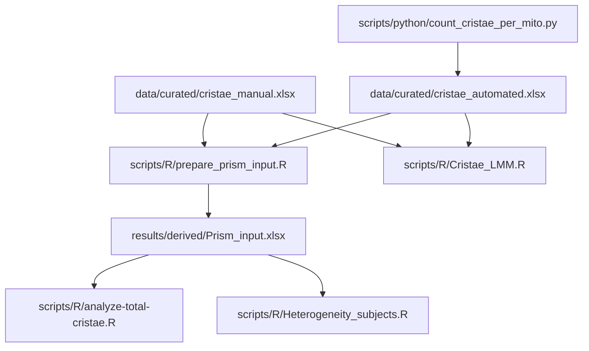

# Analysis Scripts

This directory contains the computational workflows used for preprocessing,
quality control, and statistical analysis of mitochondrial ultrastructure and
cristae morphology data.

All commands below should be run from the repository root.

## Directory structure

```text
scripts/
├── R/
│   ├── prepare_prism_input.R
│   ├── analyze-total-cristae.R
│   ├── Heterogeneity_subjects.R
│   └── Cristae_LMM.R
├── python/
│   └── count_cristae_per_mito.py
└── README.md
```

## Workflow overview

The repository contains two analytical branches:

1. **Manual measurements**, stored in
   `data/curated/cristae_manual.xlsx`.
2. **Automated measurements**, derived from Empanada segmentation outputs,
   processed with the Python workflow, and stored in
   `data/curated/cristae_automated.xlsx`.

The Python preprocessing script applies only to the automated branch. The four
R workflows operate on the curated Excel workbooks or on the combined Prism
input generated from them.



## Python preprocessing

### Script

```text
scripts/python/count_cristae_per_mito.py
```

### Purpose

The Python script processes automated segmentation outputs from the associated
Empanada-based image-analysis workflow.

It:

- matches mitochondrial and cristae segmentation files;
- assigns detected cristae to mitochondrial objects;
- creates per-image and summary CSV outputs;
- records quality-control information;
- supports portable command-line execution.

The Python workflow is not used for the manual measurement branch.

### Authorship

The original Python preprocessing script and its core computational logic were
written by **Martin Čapek**. The repository version was adapted for portable
command-line use, documented, integrated into the project, and covered by
synthetic tests with his knowledge and permission.

### Running the script

```bash
python scripts/python/count_cristae_per_mito.py \
  --mito-dir <PATH_TO_MITOCHONDRIAL_MASKS> \
  --cristae-dir <PATH_TO_CRISTAE_MASKS> \
  --output-dir <PROTECTED_OUTPUT_DIRECTORY> \
  --run-id <RUN_IDENTIFIER> \
  --fail-on-unpaired
```

Display all supported options with:

```bash
python scripts/python/count_cristae_per_mito.py --help
```

### Automated test

The synthetic Python test suite is located in:

```text
tests/python/test_count_cristae_per_mito.py
```

Run it locally with:

```bash
python -m unittest discover -s tests/python -p "test_*.py" -v
```

The same test runs through:

```text
.github/workflows/python-tests.yml
```

## R workflows

The four R scripts are implemented, documented, and covered by GitHub Actions
integration checks.

### Recommended execution order

```bash
Rscript scripts/R/prepare_prism_input.R
Rscript scripts/R/analyze-total-cristae.R
Rscript scripts/R/Heterogeneity_subjects.R
Rscript scripts/R/Cristae_LMM.R
```

The first script creates the combined Prism input required by the total-cristae
and subject-heterogeneity workflows.

`Cristae_LMM.R` is independent of the combined Prism input and reads the two
curated workbooks directly.

---

## 1. Prism input preparation

### Script

```text
scripts/R/prepare_prism_input.R
```

### Inputs

```text
data/curated/cristae_manual.xlsx
data/curated/cristae_automated.xlsx
```

### Purpose

The script:

- reads the manual and automated curated workbooks;
- standardizes their analytical structure;
- combines both measurement methods;
- performs validation checks;
- creates the shared Prism input used by the next two R workflows.

### Primary output

```text
results/derived/Prism_input.xlsx
```

### GitHub Actions workflow

```text
.github/workflows/r-prepare-prism.yml
```

---

## 2. Total cristae-count analysis

### Script

```text
scripts/R/analyze-total-cristae.R
```

### Input

```text
results/derived/Prism_input.xlsx
```

### Purpose

The script:

- validates the combined Prism input;
- performs the total-cristae count analysis;
- generates model summaries and planned contrasts;
- produces diagnostics and structured result tables;
- exports generated outputs under `results/derived/`.

### GitHub Actions workflow

```text
.github/workflows/r-total-cristae.yml
```

---

## 3. Between-subject heterogeneity analysis

### Script

```text
scripts/R/Heterogeneity_subjects.R
```

### Input

```text
results/derived/Prism_input.xlsx
```

### Purpose

The script:

- creates subject-level summaries;
- evaluates heterogeneity across controls and patient groups;
- compares manual and automated measurements;
- generates structured Excel outputs under `results/derived/`.

### GitHub Actions workflow

```text
.github/workflows/r-heterogeneity.yml
```

---

## 4. Cristae linear mixed-model analysis

### Script

```text
scripts/R/Cristae_LMM.R
```

### Inputs

```text
data/curated/cristae_manual.xlsx
data/curated/cristae_automated.xlsx
```

### Statistical design

For each eligible metric, the script fits one linear mixed-effects model:

```text
y ~ group + (1 | ID_cluster)
```

All eligible groups are fitted simultaneously. Planned contrasts compare
Controls with patient groups P1-P10.

The script uses globally unique cluster identifiers and explicit minimum-data
rules to protect against accidental identifier reuse and unsupported
comparisons.

### Excluded variables

The following variables are explicitly excluded from this analysis:

```text
Number of mito
ER connections
length of contact
average length of contact
```

The derived variable `average length of contact` is not calculated.

### Outputs

The analysis creates separate output trees for manual and automated
quantification under:

```text
results/derived/cristae_lmm_safe/
```

For each method, it exports:

- a structured Excel workbook;
- input and session information;
- quality-control counts;
- missing-value and numeric-conversion audits;
- group-level summaries;
- model-estimated means;
- planned contrasts;
- Benjamini-Hochberg adjusted p-values;
- significant-result and review-required tables;
- individual publication-style plots;
- summary heatmaps;
- multi-metric contrast overviews;
- residual-versus-fitted plots;
- Q-Q diagnostic plots.

### GitHub Actions workflow

```text
.github/workflows/r-cristae-lmm.yml
```

## Automated validation status

The repository contains five automated workflows:

| Workflow | Validation type | Status |
| --- | --- | --- |
| `python-tests.yml` | Synthetic Python unit tests | Passed |
| `r-prepare-prism.yml` | R integration check and output verification | Passed |
| `r-total-cristae.yml` | R integration check and output verification | Passed |
| `r-heterogeneity.yml` | R integration check and output verification | Passed |
| `r-cristae-lmm.yml` | R integration check and output verification | Passed |

The R workflows execute the complete repository scripts against the curated
repository inputs and verify that expected outputs are generated. They are
integration checks rather than isolated unit tests.

## Generated outputs

Generated analytical outputs are written under:

```text
results/derived/
```

They are uploaded as GitHub Actions artifacts and are not committed to the
repository unless explicitly approved for release.

Before any generated output is published, it should be reviewed for:

- subject and sample identifiers;
- filenames and local filesystem paths;
- embedded metadata;
- confidential or personal information;
- unpublished results;
- consistency with the associated research article.

## Data protection

The `scripts/` directory must not contain:

- passwords, tokens, API keys, or credentials;
- private SSH keys;
- hard-coded private filesystem paths;
- raw microscopy images;
- confidential manuscript drafts;
- unpublished figures;
- personal identifiers;
- unapproved generated research outputs.

Curated analytical inputs belong under `data/curated/`. Generated outputs
belong under `results/derived/`.
