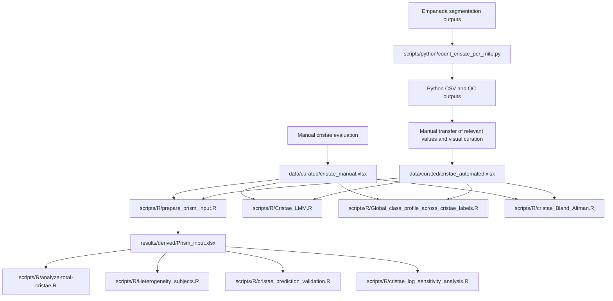

# Analysis Scripts

This directory contains the Python preprocessing workflow and eight R analysis
workflows used in the mitochondrial ultrastructure and cristae analysis.

All commands below are intended to be run from the repository root.

## Directory structure

```text
scripts/
├── R/
│   ├── Cristae_LMM.R
│   ├── Global_class_profile_across_cristae_labels.R
│   ├── Heterogeneity_subjects.R
│   ├── analyze-total-cristae.R
│   ├── cristae_Bland_Altman.R
│   ├── cristae_log_sensitivity_analysis.R
│   ├── cristae_prediction_validation.R
│   └── prepare_prism_input.R
├── python/
│   └── count_cristae_per_mito.py
└── README.md
```

## Data-flow overview

The repository contains two measurement branches.

1. **Manual branch**

   Manual measurements were entered directly into the curated manual workbook:

   ```text
   data/curated/cristae_manual.xlsx
   ```

2. **Automated branch**

   Empanada segmentation outputs were processed by the Python script. The
   Python workflow generated CSV and quality-control outputs. Relevant values
   were then transferred manually into the curated automated workbook and the
   mitochondrial labels were visually reviewed before downstream analysis:

   ```text
   data/curated/cristae_automated.xlsx
   ```

The Python script does **not** create the curated automated Excel workbook
directly. The workbook is a separate curated analytical input. The original
Python outputs remain unchanged as the primary computational outputs.



The paired image-level worksheet `compare_images` in `Prism_input.xlsx` is the
shared downstream input for the total-cristae, heterogeneity, predictive
validation, and log-transformed sensitivity workflows. Pairing and image-level
aggregation are therefore implemented once in `prepare_prism_input.R` rather
than reimplemented independently in each downstream script.

---

## Python preprocessing

### Script

```text
scripts/python/count_cristae_per_mito.py
```

### Scope

The Python script applies only to the automated branch. Manual measurements do
not pass through it.

The script processes matching mitochondrial and cristae segmentation masks and
generates computational outputs including per-mitochondrion and image-level
CSV tables, quality-control information, and run-specific output files.

### Authorship

The original Python preprocessing script and its core computational logic were
written by **Martin Čapek**. The repository version was adapted for portable
command-line execution, documented, integrated into the repository, and
covered by synthetic tests with his knowledge and permission.

### Run

```bash
python scripts/python/count_cristae_per_mito.py \
  --mito-dir <PATH_TO_MITOCHONDRIAL_MASKS> \
  --cristae-dir <PATH_TO_CRISTAE_MASKS> \
  --output-dir <PROTECTED_OUTPUT_DIRECTORY> \
  --run-id <RUN_IDENTIFIER> \
  --fail-on-unpaired
```

Display all supported options with:

```bash
python scripts/python/count_cristae_per_mito.py --help
```

### Test

The synthetic test suite is located at:

```text
tests/python/test_count_cristae_per_mito.py
```

Run it with:

```bash
python -m unittest discover -s tests/python -p "test_*.py" -v
```

The same test suite is executed by:

```text
.github/workflows/python-tests.yml
```

---

## R workflow order

Run all R workflows from the repository root.

The recommended complete sequence is:

```bash
Rscript scripts/R/prepare_prism_input.R
Rscript scripts/R/analyze-total-cristae.R
Rscript scripts/R/Heterogeneity_subjects.R
Rscript scripts/R/Cristae_LMM.R
Rscript scripts/R/Global_class_profile_across_cristae_labels.R
Rscript scripts/R/cristae_Bland_Altman.R
Rscript scripts/R/cristae_prediction_validation.R
Rscript scripts/R/cristae_log_sensitivity_analysis.R
```

`prepare_prism_input.R` creates the combined image-level input required by:

```text
scripts/R/analyze-total-cristae.R
scripts/R/Heterogeneity_subjects.R
scripts/R/cristae_prediction_validation.R
scripts/R/cristae_log_sensitivity_analysis.R
```

The following workflows read the manual and automated curated workbooks directly
and do not depend on `Prism_input.xlsx`:

```text
scripts/R/Cristae_LMM.R
scripts/R/Global_class_profile_across_cristae_labels.R
scripts/R/cristae_Bland_Altman.R
```

The two predictive workflows are intentionally ordered as:

```text
primary predictive validation
    ↓
log-transformed sensitivity analysis
```

The sensitivity model assesses robustness of the primary conclusion and does
not replace the original-scale predictive model.

---

## 1. Prism input preparation

### Script

```text
scripts/R/prepare_prism_input.R
```

### Inputs

```text
data/curated/cristae_manual.xlsx
data/curated/cristae_automated.xlsx
```

### Processing

The script:

- reads both curated workbooks;
- converts the workbook structure to per-mitochondrion records;
- aggregates measurements to one row per image;
- calculates total cristae counts, numbers of mitochondria, cristae per
  mitochondrion, and Label 2-Label 12 totals;
- joins manual and automated image-level records by group and image identifier;
- records images missing from either method;
- prepares paired tables for downstream analyses and Prism.

### Output

```text
results/derived/Prism_input.xlsx
```

The workbook contains:

```text
compare_images
BA_total
Scatter_total
BA_mean_per_mito
Scatter_mean_per_mito
BA_label_totals
QC_missing_in_auto
QC_missing_in_manual
```

`Prism_input.xlsx` is a generated analytical intermediate. It is regenerated
from the curated workbooks during relevant GitHub Actions runs instead of being
maintained manually as a separate source of truth.

### GitHub Actions

```text
.github/workflows/r-prepare-prism.yml
```

---

## 2. Total cristae-count analysis

### Script

```text
scripts/R/analyze-total-cristae.R
```

### Input

```text
results/derived/Prism_input.xlsx
```

Worksheet used:

```text
compare_images
```

### Main model

The primary negative-binomial generalized linear mixed model is:

```text
total ~ disease_status * method
        + offset(log(n_mito))
        + (1 | subject_id)
        + (1 | image_uid)
```

The analysis also fits a zero-inflated negative-binomial sensitivity model and
compares model AIC values.

### Outputs

The workflow generates:

```text
01_long_data.xlsx
02_DHARMa_diagnostics_NB.pdf
03_subject_level_cristae_per_mito.png
04_image_level_cristae_per_mito.png
05_statistical_results.xlsx
06_model_output.txt
```

The statistical workbook includes cleaned data, model coefficients,
incidence-rate ratios, model comparisons, estimated marginal means, planned
contrasts, subject-level summaries, confirmatory tests, and class-profile
tables.

### GitHub Actions

```text
.github/workflows/r-total-cristae.yml
```

---

## 3. Between-subject heterogeneity analysis

### Script

```text
scripts/R/Heterogeneity_subjects.R
```

### Input

```text
results/derived/Prism_input.xlsx
```

Worksheet used:

```text
compare_images
```

### Processing

The workflow:

- derives control and patient subject identifiers;
- converts manual and automated values to long format;
- calculates subject-level cristae-per-mitochondrion summaries;
- compares patient values with the control range;
- describes image-level variability within subjects;
- calculates subject-level Label 2-Label 12 class profiles.

### Outputs

```text
01_subject_aggregate.xlsx
02_subject_rank_plot.png
03_image_level_by_subject.png
04_class_profile_heatmap_manual.png
05_class_profile_heatmap_automated.png
06_subject_tables.xlsx
07_readme_summary.txt
```

### GitHub Actions

```text
.github/workflows/r-heterogeneity.yml
```

---

## 4. Cristae linear mixed-model analysis

### Script

```text
scripts/R/Cristae_LMM.R
```

### Inputs

```text
data/curated/cristae_manual.xlsx
data/curated/cristae_automated.xlsx
```

The two workbooks are analysed separately within one script.

### Statistical design

For each eligible metric, the workflow fits:

```text
y ~ group + (1 | ID_cluster)
```

All eligible groups are fitted simultaneously. Planned contrasts compare
Controls with patient groups P1-P10.

The workflow uses globally unique cluster identifiers, minimum-data
requirements, model diagnostics, and explicit validity flags.

### Variables analysed

The retained cristae metrics are:

```text
Label 2
Label 3
Label 4
Label 5
Label 6
Label 7
Label 8
Label 9
Label 10
Label 11
Label 12
```

### Output root

```text
results/derived/cristae_lmm_safe/
```

Separate `manual/` and `automated/` directories contain:

- structured Excel result workbooks;
- quality-control and numeric-conversion audits;
- group summaries;
- model-estimated means;
- planned contrasts;
- raw and Benjamini-Hochberg adjusted p-values;
- significant-result and review-required tables;
- individual PNG and PDF plots;
- summary heatmaps and contrast overviews;
- residual-versus-fitted and Q-Q diagnostic plots.

### GitHub Actions

```text
.github/workflows/r-cristae-lmm.yml
```

---

## 5. Global cristae class-profile analysis

### Script

```text
scripts/R/Global_class_profile_across_cristae_labels.R
```

### Inputs

```text
data/curated/cristae_manual.xlsx
data/curated/cristae_automated.xlsx
```

### Processing

The workflow:

- reads all relevant worksheets from both curated workbooks;
- identifies the columns `Label 2` through `Label 12`;
- sums valid values separately for the manual and automated methods;
- calculates the relative abundance of each class within each method;
- generates a dumbbell plot comparing both global class profiles.

For each method, relative abundance is calculated as:

```text
label total / total across Label 2-Label 12 × 100
```

### Outputs

```text
results/derived/global_class_profile/global_class_profile_data.xlsx
results/derived/global_class_profile/global_class_profile_dumbbell_colored.png
results/derived/global_class_profile/global_class_profile_dumbbell_colored.pdf
```

### GitHub Actions

```text
.github/workflows/r-global-class-profile.yml
```

---

## 6. Manual-versus-automated agreement analysis

### Script

```text
scripts/R/cristae_Bland_Altman.R
```

### Inputs

```text
data/curated/cristae_manual.xlsx
data/curated/cristae_automated.xlsx
```

### Processing

The workflow:

- aggregates `Label 2` through `Label 12` to one total count per image;
- pairs manual and automated measurements by worksheet and image identifier;
- stops if duplicate keys or incomplete pairing are detected;
- performs Bland-Altman agreement analysis;
- calculates Pearson correlation;
- fits an ordinary least-squares linear regression;
- evaluates proportional bias;
- reports a Shapiro-Wilk diagnostic for paired differences;
- exports paired data, statistical results, summaries, and figures.

The Bland-Altman difference is defined as:

```text
automated - manual
```

The 95% limits of agreement are calculated as:

```text
bias ± 1.96 × SD of paired differences
```

Pearson correlation and linear regression quantify association and are reported
separately from agreement.

### Output root

```text
results/derived/cristae_bland_altman/
```

### Statistical and audit outputs

```text
cristae_manual_vs_automated_results.xlsx
analysis_summary.txt
R_session_info.txt
```

### Figure outputs

Each plot is exported as PDF, PNG, and TIFF:

```text
Bland_Altman_agreement_plot
Manual_vs_automated_scatter_plot
Bland_Altman_and_scatter_panel
```

### GitHub Actions

```text
.github/workflows/r-cristae-bland-altman.yml
```

---

## 7. Subject-level predictive validation

### Script

```text
scripts/R/cristae_prediction_validation.R
```

### Purpose

This is the **primary predictive validation workflow**. It asks whether the
automated cristae measurement can predict the corresponding manual reference
measurement in a biological subject that was not used to fit the model.

This workflow is distinct from the inferential Ctrl-vs-HD analyses. Disease
status is retained as metadata for plots and summaries but is **not used as a
predictor**.

### Input

```text
results/derived/Prism_input.xlsx
```

Worksheet used:

```text
compare_images
```

The input workbook must first be generated with:

```bash
Rscript scripts/R/prepare_prism_input.R
```

### Biological hierarchy and validation design

The calibration model is:

```text
Manual_ij = beta_0 + beta_1 × Automated_ij + u_i + epsilon_ij
```

where:

```text
i = biological subject
j = image
u_i = subject-specific random intercept
```

Predictive performance is estimated by **leave-one-subject-out
cross-validation (LOSO-CV)**:

1. all images from one biological subject are held out;
2. the calibration model is fitted using the remaining subjects;
3. the held-out subject is predicted using fixed effects only;
4. the procedure is repeated until every subject has served as the test
   subject.

The fixed-effects-only prediction prevents random effects estimated for
training subjects from being transferred to the unseen subject.

### Endpoints

Primary endpoint:

```text
manual_mean_per_mito ~ auto_mean_per_mito
```

`mean_per_mito` is the image-level pooled number of cristae per mitochondrion.

Secondary endpoint:

```text
manual_total ~ auto_total
```

Total cristae per image is retained as a secondary endpoint because it also
depends on the number of mitochondria present in each image.

### Prediction strategies

Three strategies are evaluated:

```text
calibrated_lmm
automated_identity
training_subject_mean
```

Definitions:

- `calibrated_lmm`: LOSO prediction from the mixed-effects calibration model;
- `automated_identity`: predicted Manual = observed Automated;
- `training_subject_mean`: equal-weight mean of subject-specific Manual means
  among the training subjects.

The latter two strategies are explicit out-of-sample benchmarks.

### Predictive metrics

Image-weighted metrics:

```text
MAE
RMSE
bias_pred_minus_obs
R2_CV_pooled
```

Subject-balanced metrics:

```text
subject_balanced_MAE
subject_balanced_RMSE
```

Out-of-sample calibration:

```text
calibration_intercept
calibration_slope
```

Ideal calibration is:

```text
intercept = 0
slope = 1
```

Pairwise predictive value is additionally expressed as:

```text
Q2_vs_automated_identity
Q2_vs_training_subject_mean
```

For these Q2 metrics:

```text
Q2 > 0  calibrated model has lower squared prediction error than the reference
Q2 = 0  equal squared prediction error
Q2 < 0  calibrated model performs worse than the reference
```

### Uncertainty

The script computes 95% confidence intervals using subject-cluster bootstrap
of the already generated LOSO out-of-sample predictions.

Entire biological subjects are resampled so that within-subject image
dependence is preserved.

The bootstrap quantifies uncertainty in predictive performance across the
evaluated biological subjects; it does not refit the complete LOSO training
procedure inside each bootstrap replicate.

### Model diagnostics and safeguards

The workflow records:

```text
singular_fit
convergence_ok
optimizer_code
convergence_message
```

for LOSO folds and the descriptive full-data models.

The script also checks:

- required input columns;
- duplicate `group + image_id` keys;
- expected subject/group labels;
- expected control image identifiers;
- minimum subject counts;
- predictor variability within each training fold;
- missing endpoint measurements;
- manual-versus-automated mitochondrial-count consistency.

### Outputs

Output root:

```text
results/derived/cristae_prediction_validation/
```

Main files:

```text
01_prediction_input_and_QC.xlsx
02_LOSO_predictions.xlsx
03_prediction_performance.xlsx
04_prediction_model_report.txt
R_session_info.txt
```

Endpoint-specific directories:

```text
results/derived/cristae_prediction_validation/cristae_per_mito/
results/derived/cristae_prediction_validation/total_cristae_per_image/
```

The directories contain predictive plots and descriptive full-model
diagnostics in PNG and PDF format.

The complete-data calibration model is exported for calibration-equation and
diagnostic purposes only. Predictive performance must be interpreted from the
LOSO out-of-sample results.

### GitHub Actions

```text
.github/workflows/r-cristae-prediction-validation.yml
```

The workflow:

1. checks out the repository;
2. installs required R dependencies;
3. regenerates `Prism_input.xlsx`;
4. runs the complete predictive-validation script;
5. verifies required outputs;
6. uploads the generated results as a GitHub Actions artifact.

---

## 8. Log-transformed predictive sensitivity analysis

### Script

```text
scripts/R/cristae_log_sensitivity_analysis.R
```

### Purpose

This is a **sensitivity analysis for the primary predictive workflow**.

It evaluates whether the primary predictive conclusion remains similar when
the calibration model is fitted after `log1p` transformation, reducing the
influence of very large values and heteroscedasticity.

It does not replace the original-scale predictive model.

### Input

```text
results/derived/Prism_input.xlsx
```

Worksheet used:

```text
compare_images
```

Generate the input first with:

```bash
Rscript scripts/R/prepare_prism_input.R
```

### Validation design

The subject-level validation structure is the same as in the primary
predictive analysis:

```text
Leave-one-subject-out cross-validation
```

All images from the held-out subject remain outside the training set.

The log-scale mixed model is:

```text
log1p(Manual_ij) =
    beta_0 + beta_1 × log1p(Automated_ij) + u_i + epsilon_ij
```

Held-out subjects are predicted using fixed effects only.

### Duan smearing retransformation

Predictions are returned to the original measurement scale.

Within every LOSO fold, population-level residuals are calculated **only from
the training data** and used to estimate a fold-specific Duan smearing factor.

The corrected prediction is:

```text
predicted Manual =
    exp(predicted log1p value) × smearing factor - 1
```

The script also retains the naive retransformation as a diagnostic but uses the
Duan-corrected prediction as the main sensitivity prediction.

### Endpoints

The sensitivity analysis uses the same endpoints as the primary predictive
workflow.

Primary:

```text
manual_mean_per_mito ~ auto_mean_per_mito
```

Secondary:

```text
manual_total ~ auto_total
```

### Benchmarks and metrics

The same two benchmark strategies are used:

```text
automated_identity
training_subject_mean
```

The workflow reports:

```text
MAE
RMSE
bias_pred_minus_obs
R2_CV_pooled
subject_balanced_MAE
subject_balanced_RMSE
calibration_intercept
calibration_slope
Q2_vs_automated_identity
Q2_vs_training_subject_mean
```

Subject-cluster bootstrap 95% confidence intervals are calculated for
predictive metrics and Q2 comparisons.

### Model diagnostics and safeguards

The workflow checks and records:

- required input columns;
- unexpected or missing group labels;
- unexpected control image identifiers;
- duplicate image keys;
- negative input values incompatible with the intended `log1p` analysis;
- minimum numbers of paired observations and biological subjects;
- fold-specific predictor variability;
- LMM convergence;
- singular model fits;
- validity of the fold-specific Duan smearing factor;
- any negative Duan-corrected back-transformed predictions.

Negative back-transformed predictions are flagged rather than silently
truncated.

### Outputs

Output root:

```text
results/derived/log_sensitivity_prediction/
```

Main files:

```text
log_sensitivity_prediction_results.xlsx
log_sensitivity_report.txt
R_session_info.txt
```

Endpoint-specific directories:

```text
results/derived/log_sensitivity_prediction/cristae_per_mito/
results/derived/log_sensitivity_prediction/total_cristae_per_image/
```

They contain LOSO prediction plots, subject-level prediction-error plots, and
log-scale residual diagnostics.

### Interpretation

This workflow is intended to answer a robustness question:

> Does the conclusion from the primary original-scale predictive model remain
> similar when the data are modelled on the `log1p` scale and predictions are
> retransformed with a training-fold-specific Duan correction?

The sensitivity analysis should therefore be interpreted alongside, and not
instead of, `cristae_prediction_validation.R`.

### GitHub Actions

```text
.github/workflows/r-cristae-log-sensitivity.yml
```

The workflow:

1. checks out the repository;
2. installs required R dependencies;
3. regenerates `Prism_input.xlsx`;
4. runs the complete log-transformed sensitivity analysis;
5. verifies required output files and figures;
6. uploads the generated results as a GitHub Actions artifact.

---

## Automated validation

The repository contains nine GitHub Actions workflows.

| Workflow | Check | Status |
| --- | --- | --- |
| `python-tests.yml` | Synthetic Python test suite | Passed |
| `r-prepare-prism.yml` | Prism-input execution and expected-output verification | Passed |
| `r-total-cristae.yml` | Total-cristae execution and expected-output verification | Passed |
| `r-heterogeneity.yml` | Subject-heterogeneity execution and expected-output verification | Passed |
| `r-cristae-lmm.yml` | Manual and automated LMM execution and expected-output verification | Passed |
| `r-global-class-profile.yml` | Global class-profile execution and output verification | Passed |
| `r-cristae-bland-altman.yml` | Agreement-analysis execution and output verification | Passed |
| `r-cristae-prediction-validation.yml` | Subject-level LOSO predictive validation and output verification | Passed |
| `r-cristae-log-sensitivity.yml` | Log-transformed LOSO sensitivity analysis and output verification | Passed |

The Python workflow is covered by synthetic tests. The R workflows are covered
by integration checks that run complete scripts against repository analytical
inputs and verify the expected generated outputs.

The predictive workflows also regenerate `Prism_input.xlsx` from the curated
manual and automated workbooks before running the downstream analyses. This
tests the complete dependency chain rather than relying on a manually supplied
derived workbook.

---

## Generated outputs

Generated analytical outputs are written under:

```text
results/derived/
```

They are uploaded as GitHub Actions artifacts. They should not be committed to
the repository unless their public release has been explicitly approved.

The generated `Prism_input.xlsx` workbook is likewise treated as a reproducible
intermediate output rather than an independently curated source file.

---

## Data protection

Do not place any of the following in `scripts/`:

- credentials, API keys, access tokens, or private SSH keys;
- personal or subject identifiers;
- private filesystem paths;
- raw microscopy images;
- protected segmentation files;
- confidential manuscript files;
- unpublished or unapproved result files.

Curated analytical inputs belong under:

```text
data/curated/
```

Generated analytical outputs belong under:

```text
results/derived/
```
